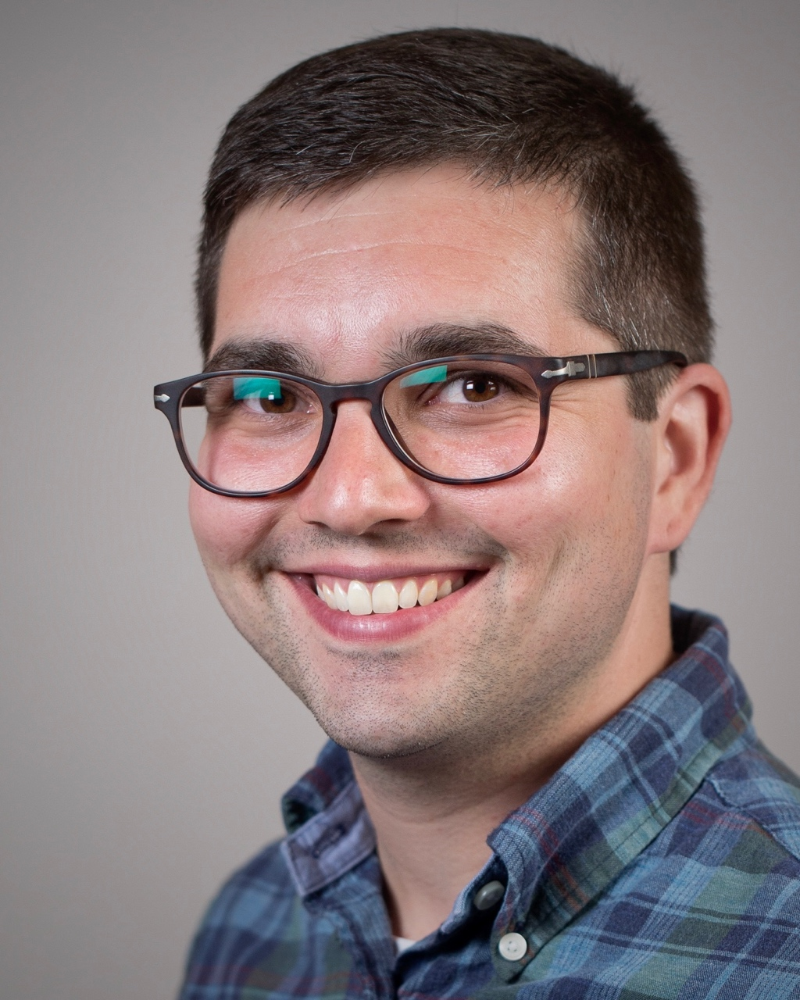

***

## About your instructor {-}

Hi, folks! 

I'm Eric. I'm your instructor for MA22004 this semester. I am a new Baxter Fellow in Applied Mathematics at Dundee and my research focuses on uncertainty quantification and predictive modeling.  

Originally from the US, I wrote my PhD in Probability and Stochastic Analysis at the University of Edinburgh.  Math and stats has opened up some exciting doors for me and I've had the opportunity to undertake postdoctoral work at KTH Stockholm, University of Massachusetts Amherst, and RWTH Aachen University. I'm very excited to be moving to Dundee and back to Scotland. I'm even more excited to be teaching you statistics this semester!