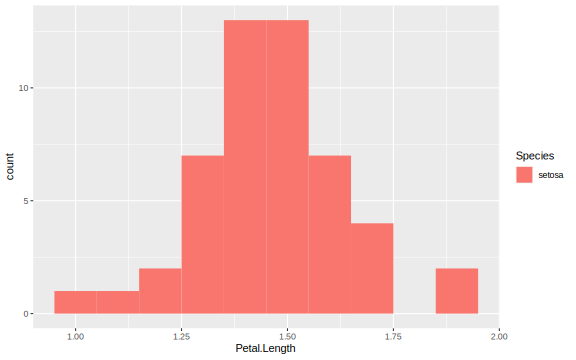

\newcommand{\V}{\operatorname{Var}}
\newcommand{\E}{\operatorname{E}}
\newcommand{\P}{P}
\newcommand{\se}{\mathsf{se}}

# Basics of statistical inference {#statistical-inference}

## Point estimation {#point-estimation}

A **statistic** is a quantity that can be calculated from sample data. Prior to obtaining data, a statistic is an unknown quantity and is therefore a rv. We refer to the probability distribution for a statistic as a **sampling distribution** to emphasize how the distribution will vary across all possible sample data. 

Statistical inference seeks to draw conclusions about the characteristics of a population from data. For example, suppose we are botanists interested in taxonomic classification of iris flowers. Let $\mu$ denote the true average petal length (in cm) of the [*Iris setosa*](https://www.wikiwand.com/en/Iris_setosa) (AKA the bristle-pointed iris). The parameter $\mu$ is a characteristic of the whole population for the *setosa* species. Before we collect data, the petal lengths of $n$ independent *setosa* flowers are denoted by rvs $X_1, X_2, \dots, X_n$. Any function of the $X_i$'s, such as the sample mean,
\begin{equation}
  \overline{X} = \frac{1}{n} \sum_{i=1}^n X_i\,, (\#eq:sample-mean)
\end{equation}
or the sample variance,
\begin{equation*}
  S^2 = \frac{1}{n-1} \sum_{i=1}^n (X_i - \overline{X})^2 \,,
\end{equation*}
is also a rv. 

Suppose we actually find and measure the petal length of $50$ independent *setosa* flowers resulting in observations $x_1, x_2, \dots, x_{50}$; the distribution (counts) of $50$ such petal length measurements are displayed in Figure \@ref(fig:setosa-petal-lengths). The sample mean $\overline{x}$ for petal length could then be used to draw a conclusion about the value of the population mean $\mu$. Similarly, if $\sigma^2$ is the variance of the *setosa* petal length then $s^2$ can be used to infer something about the value of $\sigma^2$. Based on the data in Figure \@ref(fig:setosa-petal-lengths) and using \@ref(eq:sample-mean), the value of the sample mean is $\overline{x} = 1.462$. The value $\overline{x}$ provides a "best guess" or point estimate for the true value of $\mu$ based on the $n=50$ samples. 

<div class="figure">

<p class="caption">(\#fig:setosa-petal-lengths)The distribution (counts) of $50$ *setosa* petal length measurments.</p>
</div>

> The botonist Edgar Anderson's **Iris Data** contains three plant species (*setosa*, *virginica*, *versicolor*) and four features (sepal length & width, petal length & width) measured in cm for each sample. This data set can be accessed in `r` by loading `library(datasets)` and then calling `data(iris)`. 

\BeginKnitrBlock{definition}<div class="definition"><span class="definition" id="def:point-estimate"><strong>(\#def:point-estimate) </strong></span>A **point estimate** of a parameter $\theta$ (recall: a fixed, unknown quantity) is a single number that we regard as a sensible value for $\theta$. Let $X_1, X_2, \dots, X_n$ be iid samples from a distribution $F(\theta)$. A **point estimator** $\widehat{\theta}_n$ of a parameter $\theta$ is obtained by selecting a suitable statistic $g$,
\begin{equation*}
  \widehat{\theta}_n = g(X_1, \dots, X_n) \,.
\end{equation*}
A point estimate $\widehat{\theta}_n$ can then be computed from the estimator using sample data.</div>\EndKnitrBlock{definition}

> ⚠️  The symbol $\widehat{\theta}_n$ (or simply $\widehat{\theta}$ when the sample size $n$ is clear from context) is typically used to denote both the estimator and the point estimate resulting from a given sample. Note that writing, e.g., $\widehat{\theta} = 42$ does not indicate how the point estimate was obtained. Therefore, it is essential to report both the estimator and the resulting point estimate. 

Note that Definition \@ref(def:point-estimate) above does not say how to select the appropriate statistic. For the *setosa* example, the sample mean $\overline{X}$ is suggested as a good estimator of the population mean $\mu$. That is, $\widehat{\mu} = \overline{X}$ or "the point estimator of $\mu$ is the sample mean $\overline{X}$". Here, while $\mu$ and $\sigma^2$ are fixed quantities representing characteristics of the population, $\overline{X}$ and $S^2$ are rvs with sampling distributions. If the population is *normally distributed* or if the *sample is large* then the sampling distribution for $\overline{X}$ has a known form: $\overline{X}$ is normal with mean $\mu_{\overline{X}} = \mu$ and variance $\sigma_{\overline{X}} = \sigma^{2} / n$, i.e.,
\begin{equation*}
  \overline{X} \sim \mathcal{N}(\mu, \sigma^{2} / n) \,,
\end{equation*}
where $n$ is the sample size and $\mu$ and $\sigma$ are the (typically unknown) population parameters.

\BeginKnitrBlock{example}<div class="example"><span class="example" id="exm:eg-estimators"><strong>(\#exm:eg-estimators) </strong></span>Let us consider the heights (measured in inches) of $31$ black cherry trees (sorted, for your enjoyment):
</div>\EndKnitrBlock{example}

```
 [1] 63 64 65 66 69 70 71 72 72 74 74 75 75 75 76 76 77 78 79 80 80 80 80 80 81
[26] 81 82 83 85 86 87
```

The quantile-quantile normal probability plot of this data is quite straight, so we assume that the distribution of black cherry tree heights is normal with a mean value $\mu$. The observations $X_1, \dots, X_{31}$ are then assumed to be a random sample from this normal distribution. Consider the following estimators and resulting point estimates for $\mu$.

a. Estimator (sample mean) $\overline{X}$ as in \@ref(eq:sample-mean) and estimate $\overline{x} = \sum x_i / n = 2356 / 31 = 76$.

b. Estimator (average of extreme heights) $\widetilde{X} = [\min(X_i) + \max(X_i)]/2$ and estimate $\widetilde{x} = (63 + 87)/2 = 75$. 

c. Estimator ($10\%$ trimmed mean -- i.e., in this instance exclude the smallest and largest three values) $\overline{X}_{\text{tr}(10)}$ and estimate $\overline{x}_{\text{tr}(10)} = (2356 - 63 - 64 - 65 - 87 - 86 - 85) / 25 = 76.24$. 

Each estimator above uses a different notion of center for the sample data. An interesting question to think about is: which estimator will tend to produce estimates closest to the true parameter value? Will the estimators work universally well for all distributions?
````

**TODO**: insert exercise 19 p 61 from All of Stats. Don't confuse distribution of data from distribution of statistic. Don't confuse sampling distribution with population distribution. 

In addition to reporting a point estimate (together with its estimator), some indication of its precision should be given. One measure of the precision in an estimate is to report its standard error. 

\BeginKnitrBlock{definition}<div class="definition"><span class="definition" id="def:standard-error"><strong>(\#def:standard-error) </strong></span>The **standard error** of an estimator $\widehat{\theta}$ is the standard deviation $\sigma_{\widehat{\theta}} = \sqrt{\V(\widehat{\theta})}$ (sometimes denoted $\se = \se(\widehat{\theta})$). Often, the standard error depends on unknown parameters and must also be estimated. The estimated standard error is denoted by $\widehat{\sigma}_{\widehat{\theta}}$ or $s_{\widehat{\theta}}$ or $\widehat{\se}$. </div>\EndKnitrBlock{definition}

## Confidence intervals {#confidence-intervals}

## Hypothesis testing {#hypothesis-testing}
