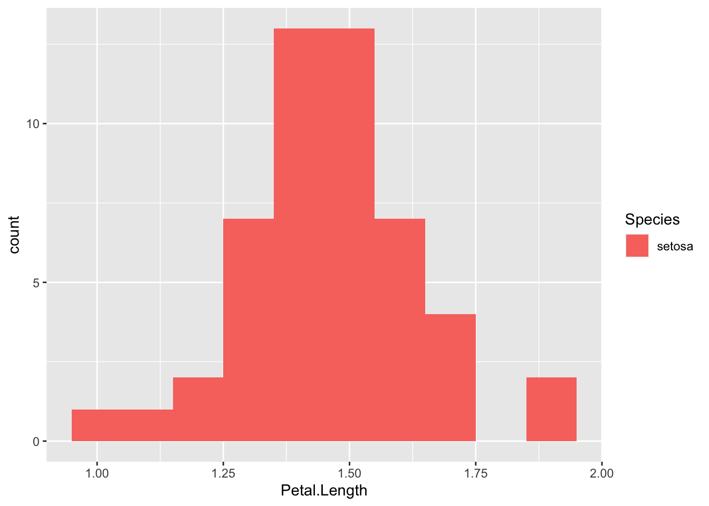

\newcommand{\Var}{\operatorname{Var}}
\newcommand{\E}{\operatorname{E}}
\newcommand{\se}{\mathsf{se}}

# Inferences based on a single sample {#statistical-inference}

## Point estimation {#point-estimation}

A **statistic** is a quantity that can be calculated from sample data. Prior to obtaining data, a statistic is an unknown quantity and is therefore a rv. We refer to the probability distribution for a statistic as a **sampling distribution** to emphasize how the distribution will vary across all possible sample data. 

Statistical inference seeks to draw conclusions about the characteristics of a population from data. For example, suppose we are botanists interested in taxonomic classification of iris flowers. Let $\mu$ denote the true average petal length (in cm) of the [*Iris setosa*](https://www.wikiwand.com/en/Iris_setosa) (AKA the bristle-pointed iris). The parameter $\mu$ is a characteristic of the whole population for the *setosa* species. Before we collect data, the petal lengths of $n$ independent *setosa* flowers are denoted by rvs $X_1, X_2, \dots, X_n$. Any function of the $X_i$'s, such as the sample mean,
\begin{equation}
  \overline{X} = \frac{1}{n} \sum_{i=1}^n X_i\,, (\#eq:sample-mean)
\end{equation}
or the sample variance,
\begin{equation*}
  S^2 = \frac{1}{n-1} \sum_{i=1}^n (X_i - \overline{X})^2 \,, (\#eq:sample-var)
\end{equation*}
is also a rv. 

Suppose we actually find and measure the petal length of $50$ independent *setosa* flowers resulting in observations $x_1, x_2, \dots, x_{50}$; the distribution (counts) of $50$ such petal length measurements are displayed in Figure \@ref(fig:setosa-petal-lengths). The sample mean $\overline{x}$ for petal length could then be used to draw a conclusion about the value of the population mean $\mu$. Similarly, if $\sigma^2$ is the variance of the *setosa* petal length then $s^2$ can be used to infer something about the value of $\sigma^2$. Based on the data in Figure \@ref(fig:setosa-petal-lengths) and using \@ref(eq:sample-mean), the value of the sample mean is $\overline{x} = 1.462$. The value $\overline{x}$ provides a "best guess" or point estimate for the true value of $\mu$ based on the $n=50$ samples. 

(\#fig:setosa-petal-lengths)The distribution (counts) of $50$ *setosa* petal length measurments.

> The botonist Edgar Anderson's **Iris Data** contains 50 obs. of four features (sepal length [cm], sepal width [cm], petal length [cm], and petal width [cm]) for each of three plant species (*setosa*, *virginica*, *versicolor*) for 150 obs. total. This data set can be accessed in `r` by loading `library(datasets)` and then calling `data(iris)`. 

\BeginKnitrBlock{definition}
<strong>(\#def:point-estimate) </strong>A **point estimate** of a parameter $\theta$ (recall: a fixed, unknown quantity) is a single number that we regard as a sensible value for $\theta$. Let $X_1, X_2, \dots, X_n$ be iid samples from a distribution $F(\theta)$. A **point estimator** $\widehat{\theta}_n$ of a parameter $\theta$ is obtained by selecting a suitable statistic $g$,
\begin{equation*}
  \widehat{\theta}_n = g(X_1, \dots, X_n) \,.
\end{equation*}
A point estimate $\widehat{\theta}_n$ can then be computed from the estimator using sample data.
\EndKnitrBlock{definition}

> ⚠️  The symbol $\widehat{\theta}_n$ (or simply $\widehat{\theta}$ when the sample size $n$ is clear from context) is typically used to denote both the estimator and the point estimate resulting from a given sample. Note that writing, e.g., $\widehat{\theta} = 42$ does not indicate how the point estimate was obtained. Therefore, it is essential to report both the estimator and the resulting point estimate. 

Note that Definition \@ref(def:point-estimate) above does not say how to select the appropriate statistic. For the *setosa* example, the sample mean $\overline{X}$ is suggested as a good estimator of the population mean $\mu$. That is, $\widehat{\mu} = \overline{X}$ or "the point estimator of $\mu$ is the sample mean $\overline{X}$". Here, while $\mu$ and $\sigma^2$ are fixed quantities representing characteristics of the population, $\overline{X}$ and $S^2$ are rvs with sampling distributions. If the population is *normally distributed* or if the *sample is large* then the sampling distribution for $\overline{X}$ has a known form: $\overline{X}$ is normal with mean $\mu_{\overline{X}} = \mu$ and variance $\sigma_{\overline{X}}^2 = \sigma^{2} / n$, i.e.,
\begin{equation*}
  \overline{X} \sim \mathcal{N}(\mu, \sigma^{2} / n) \,,
\end{equation*}
where $n$ is the sample size and $\mu$ and $\sigma$ are the (typically unknown) population parameters.

\BeginKnitrBlock{example}
<strong>(\#exm:eg-estimators) </strong>Let us consider the heights (measured in inches) of $31$ black cherry trees (sorted, for your enjoyment): `63 64 65 66 69 70 71 72 72 74 74 75 75 75 76 76 77 78 79 80 80 80 80 80 81 81 82 83 85 86 87`.

The quantile-quantile normal probability plot of this data is fairly straight, so we assume that the distribution of black cherry tree heights is normal with a mean value $\mu$. The observations $X_1, \dots, X_{31}$ are then assumed to be a random sample from this normal distribution. Consider the following estimators and resulting point estimates for $\mu$.

a. Estimator (sample mean) $\overline{X}$ as in \@ref(eq:sample-mean) and estimate $\overline{x} = \sum x_i / n = 2356 / 31 = 76$.

b. Estimator (average of extreme heights) $\widetilde{X} = [\min(X_i) + \max(X_i)]/2$ and estimate $\widetilde{x} = (63 + 87)/2 = 75$. 

c. Estimator ($10\%$ trimmed mean -- i.e., in this instance exclude the smallest and largest three values) $\overline{X}_{\text{tr}(10)}$ and estimate $\overline{x}_{\text{tr}(10)} = (2356 - 63 - 64 - 65 - 87 - 86 - 85) / 25 = 76.24$. 

Each estimator above uses a different notion of center for the sample data. An interesting question to think about is: which estimator will tend to produce estimates closest to the true parameter value? Will the estimators work universally well for all distributions?
\EndKnitrBlock{example}

> The **Cherry Tree Data** contains 31 obs. of three features (diameter [in], height [in], and volume [cu ft]) and can be accessed in `r` by loading `library(datasets)` and then calling `data(trees)`. 

In addition to reporting a point estimate (together with its estimator), some indication of its precision should be given. One measure of the precision in an estimate is to report its standard error. 

\BeginKnitrBlock{definition}
<strong>(\#def:standard-error) </strong>The **standard error** of an estimator $\widehat{\theta}$ is the standard deviation $\sigma_{\widehat{\theta}} = \sqrt{\Var(\widehat{\theta})}$ (sometimes denoted $\se = \se(\widehat{\theta})$). Often, the standard error depends on unknown parameters and must also be estimated. The estimated standard error is denoted by $\widehat{\sigma}_{\widehat{\theta}}$ or $s_{\widehat{\theta}}$ or $\widehat{\se}$. 
\EndKnitrBlock{definition}

## Confidence intervals {#confidence-intervals}

An alternative to reporting a point estimate for a parameter is to report an interval estimate that suggests an entire range of plausible values for the parameter of interest. A confidence interval is an interval estimate that makes a probability statement about the degree of reliability, or the confidence level, of the interval. The first step in computing a confidence interval is always to select the confidence level. A popular choice is a $95\%$ confidence interval which corresponds to level $\alpha = 0.05$. 

\BeginKnitrBlock{definition}
<strong>(\#def:confidence-interval-gen) </strong>A $(1-\alpha)$ **confidence interval** for a parameter $\theta$ is a *random* interval $C_n = (a, b)$ where $a = a(X_1, \dots, X_n)$ and $b = b(X_1, \dots, X_n)$ are functions of the data such that 
\begin{equation}
P_{\theta}(\theta \in C_n ) = 1 - \alpha\,, 
\end{equation}
for all $\theta \in \Theta$. 
\EndKnitrBlock{definition}

My favorite interpretation of a confidence interval is due to [@Wasserman:2013as, p 92]:  

> On day 1, you collect data and construct a 95 percent confidence interval for a parameter $\theta_1$. On day 2, you collect new data and construct a 95 percent confidence interval for an unrelated parameter $\theta_2$. On day 3, you collect new data and construct a 95 percent confidence interval for an unrelated parameter $\theta_3$. You continue this way constructing confidence intervals for a sequence of unrelated parameters $\theta_1$, $\theta_2$, $\dots$ Then 95 percent of your intervals will trap the true parameter value. There is no need to introduce the idea of repeating the same experiment over and over.  

This interpretation makes clear that a confidence interval is not a probability statement about the parameter $\theta$ (as $\theta$ is not a rv). In Definition \@ref(def:confidence-interval-gen), note that $\theta$ is fixed and the interval $C_n$ is random.

**TODO**: add plot EG devore fig 7.3 that illustrates ca. 100 95\% CIs (with astreisks identifying intervals that do not inlcude $\mu$).

If the parameter of interest is the population mean $\theta = \mu$, then one can derive the form of the confidence interval using the fact that the sample mean $\widehat{\theta} = \overline{X}$ has (at least approximately) a normal distribution. We will consider three cases:

1. [CI for $\mu$ of a normal population with known $\sigma^2$](#ci-normal-var-known),
2. [CI for $\mu$ of any population with unknown $\sigma^2$, when the sample size $n$ is large](#ci-large-sample),
3. [CI for $\mu$ of a normal population with unknown $\sigma^2$, when the sample size $n$ is small](#ci-normal-var-unknown).

In general, the confidence intervals for the mean based on normality theory will have the form:
\begin{equation}
\text{point estimate}\; \mu \pm (\text{critical value of reference dist.}) \cdot (\text{precision of point estimate})\,, (\#eq:ci-gen-form)
\end{equation}
where the reference distribution will be the standard normal (for 1. and 2.) and the Student's $t$ distribution (for 3.). The critical value corresponds to the two-sided (symmetric) tail areas under the reference distribution.

### CI for mean of a Normal population with known variance {#ci-normal-var-known}

\BeginKnitrBlock{definition}
<strong>(\#def:ci-norm-known-var) </strong>A **$100(1-\alpha)\%$ confidence interval** for the mean $\mu$ of a normal population when the value of $\sigma^2$ is known is given by 
\begin{equation} 
 \left(\overline{x} - z_{\alpha/2} \cdot \frac{\sigma}{\sqrt{n}}\,, 
        \overline{x} + z_{\alpha/2} \cdot \frac{\sigma}{\sqrt{n}} \right)\,,  (\#eq:ci-norm-known-var)
\end{equation}
or $\overline{x} \pm z_{\alpha/2} \cdot \sigma / \sqrt{n}$. 
\EndKnitrBlock{definition}

The CI for the mean \@ref(eq:ci-norm-known-var) can be expressed as 
\begin{equation*}
 \text{point estimate}\; \mu \pm 
 (z \;\text{critical value}) \cdot (\text{standard error of mean})\,.
\end{equation*}
The $z$ critical value is related to the tail areas under the standard normal curve; we need to find the $z$-score having a cumulative probability equal to $1-\alpha/2$. Below we provide a table containing commonly used normal critical values. 

<table>
 <thead>
  <tr>
   <th style="text-align:left;"> $\alpha =$ tail area </th>
   <th style="text-align:left;"> central area $= 1 – 2\alpha$ </th>
   <th style="text-align:left;"> $z_\alpha$ </th>
  </tr>
 </thead>
<tbody>
  <tr>
   <td style="text-align:left;"> $0.10$ </td>
   <td style="text-align:left;"> $0.80$ </td>
   <td style="text-align:left;"> $z_{.10} = 1.28$ </td>
  </tr>
  <tr>
   <td style="text-align:left;"> $0.05$ </td>
   <td style="text-align:left;"> $0.90$ </td>
   <td style="text-align:left;"> $z_{.05} = 1.645$ </td>
  </tr>
  <tr>
   <td style="text-align:left;"> $0.025$ </td>
   <td style="text-align:left;"> $0.95$ </td>
   <td style="text-align:left;"> $z_{.025} = 1.96$ </td>
  </tr>
  <tr>
   <td style="text-align:left;"> $0.01$ </td>
   <td style="text-align:left;"> $0.98$ </td>
   <td style="text-align:left;"> $z_{.01} = 2.33$ </td>
  </tr>
  <tr>
   <td style="text-align:left;"> $0.005$ </td>
   <td style="text-align:left;"> $0.99$ </td>
   <td style="text-align:left;"> $z_{.005} = 2.58$ </td>
  </tr>
</tbody>
</table>

**TODO**: add example 

As noted in \@ref(eq:ci-gen-form) and \@ref(eq:ci-norm-known-var), the width of a CI is related to the estimator's precision. The confidence level (or reliability) is inversely related to this precision. When the population is normal and the variance is known, then an appealing strategy is to determine the sample size necessary to achieve a desired confidence level and precision. A general formula for the sample size $n$ necessary to achieve an interval width $w$ is obtained at confidence level  $\alpha$ is obtained by equating $w$ to $2z_{\alpha/2} \cdot \sigma /\sqrt{n}$ and then solving for $n$. 
\BeginKnitrBlock{proposition}
<strong>(\#prp:ci-select-n-fixed-w-alpha) </strong>The sample size $n$ required to achieve a CI for $\mu$ with width $w$ at level $\alpha$ is given by,
\begin{equation}
n = \left( 2 z_{\alpha/2} \cdot \frac{\sigma}{w} \right)^2 \,.
\end{equation}
\EndKnitrBlock{proposition}
From Proposition \@ref(prp:ci-select-n-fixed-w-alpha), we see that the smaller the desired $w$ then the larger $n$ must be (and subsequently, the more effort that must be allocated to data collection).

**TODO**: add example of sample size calculation

### Large-sample CI for mean of a population with unknown variance {#ci-large-sample}

Consider samples $X_1, \dots, X_n$ from a population with mean $\mu$ and variance $\sigma^2$. Provided that $n$ is large enough, the Central Limit Theorem implies that the estimator for the sample mean $\overline{X}$ in \@ref(eq:sample-mean) has *approximately* a normal distribution. Then 
\begin{equation}
P \left( - z_{\alpha/2} < \frac{\overline{X} - \mu}{\sigma/\sqrt{n}} < z_{\alpha/2} \right) \approx 1 - \alpha\,,
\end{equation}
since the transformed variable has approximately a standard normal distribution. Thus, computing a point estimate based on a large $n$ of samples yields a CI for the population parameter $\mu$ at an *approximate* confidence level $\alpha$. However, it is often the case that the variance is unknown. When $n$ is large, replacing the population variance $\sigma^2$ by the sample variance $S^2$ in \@ref(eq:sample-var) will not typically introduce too much additional variability.

\BeginKnitrBlock{proposition}
<strong>(\#prp:ci-large-sample) </strong>A **large-sample confidence interval** at level approximately $100(1-\alpha)\%$ for the mean $\mu$ of any population when the variance is uknown is given by 
\begin{equation} 
 \left(\overline{x} - z_{\alpha/2} \cdot \frac{s}{\sqrt{n}} \,, 
        \overline{x} + z_{\alpha/2} \cdot \frac{s}{\sqrt{n}} \right)\,,  (\#eq:ci-large-sample)
\end{equation}
or $\overline{x} \pm z_{\alpha/2} \cdot s / \sqrt{n}$. 
\EndKnitrBlock{proposition}

The CI for the mean \@ref(eq:ci-large-sample) applies regardless of the shape of the population distribution so long as the number of samples is large. A rule of thumb is that $n > 40$ is sufficient. In words, the CI \@refeq:ci-large-sample) can be expressed as 
\begin{equation*}
 \text{point estimate}\; \mu \pm 
 (z \;\text{critical value}) \cdot (\text{estimated standard error of mean})\,.
\end{equation*}
Typically, a large-sample CI for a general parameter $\theta$ similar to \@ref(eq:ci-large-sample) holds for any estimator $\widehat{\theta}$ that satisfies: (1) approximately normal in distribution, (2) approximately unbiased, and (3) an expression for the standard error is available.

**TODO**: add example 

### CI for mean of a normal population with unknown variance {#ci-normal-var-unknown}

In Section \@ref(ci-normal-var-known), we considered samples $X_1, \dots, X_n$ from a normal population with a known $\mu$ and $\sigma^2$. In contrast, here we consider samples from a normal population and assume the population parameters $\mu$ and $\sigma^2$ are unknown. If the number of samples is large, the discussion in Section \@ref(ci-large-sample) indicates that the rv $Z = (\overline{X} - \mu) \sqrt{n} / S$ has approximately a standard normal distribution. However, if $n$ is not sufficiently large then the transformed variable will be more spread out than a standard normal distribution. 

\BeginKnitrBlock{theorem}
<strong>(\#thm:sample-mean-t-dist) </strong>For the sample mean $\overline{X}$ based on $n$ samples from a normal distribution with mean $\mu$, the rv
\begin{equation}
 T = \frac{\overline{X} - \mu}{S} \sqrt{n} \quad \sim t_{n-1}\,,
\end{equation}
that is, $T$ has Student's $t$ distribution with $\nu = n-1$ degrees of freedom (df). 
\EndKnitrBlock{theorem}

This leads us to consider a CI for the population parameter $\mu$ that is based on critical values of the $t$ distribution. 

\BeginKnitrBlock{definition}
<strong>(\#def:ci-norm-unknown-var) </strong>A **$100(1-\alpha)\%$ confidence interval** for the mean $\mu$ of a normal population when the value of $\sigma^2$ is unknown is given by 
\begin{equation} 
 \left(\overline{x} - t_{\alpha/2, n-1} \cdot \frac{s}{\sqrt{n}}\,, 
        \overline{x} + t_{\alpha/2, n-1} \cdot \frac{s}{\sqrt{n}} \right)\,,  (\#eq:ci-norm-known-var)
\end{equation}
or $\overline{x} \pm t_{\alpha/2, n-1} \cdot s/ \sqrt{n}$. Here $\overline{x}$ and $s$ are the sample mean and sample standard deviation, respectively.
\EndKnitrBlock{definition}

In contrast to Proposition \@ref(prp:ci-select-n-fixed-w-alpha), it is difficult to select the sample size $n$ to control the width of the $t$-based CI as the width involves the unknown (before the sample is acquired) $s$ and because $n$ also enters through $t_{\alpha/2, n-1}$.  

**TODO**: add example 
 
## Hypothesis testing {#hypothesis-testing}

