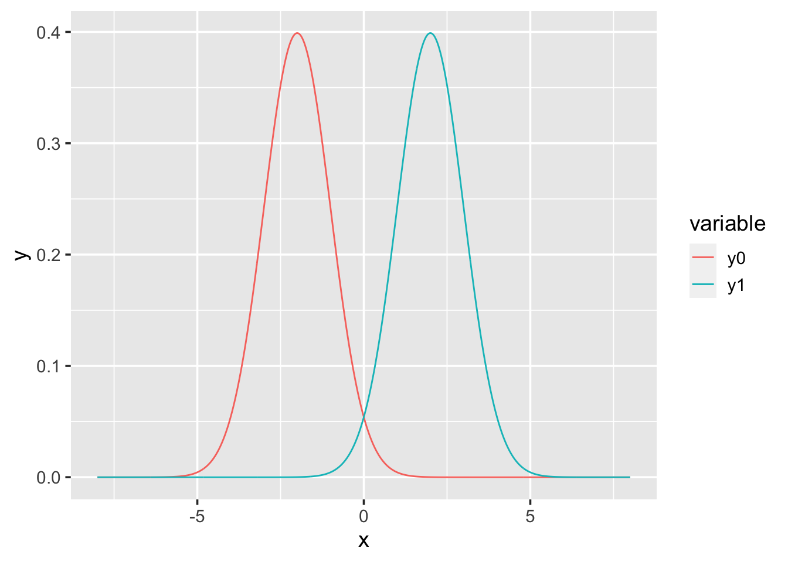
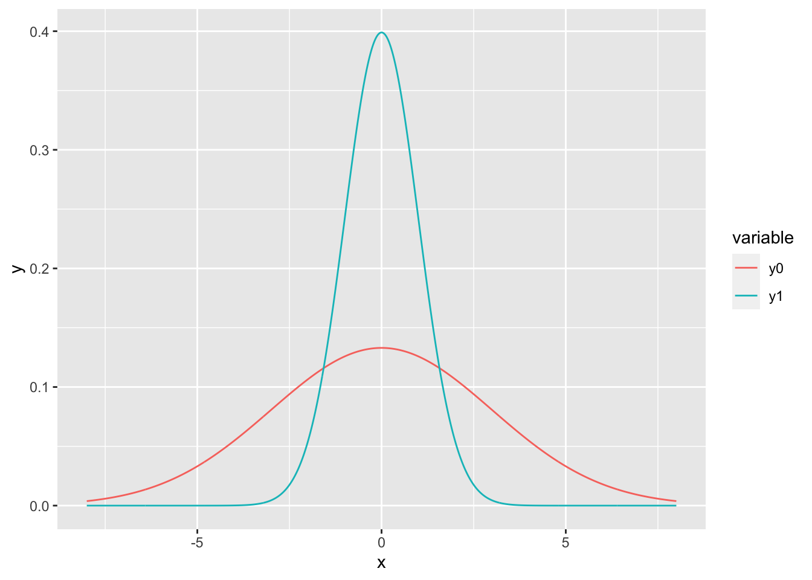

\newcommand{\Var}{\operatorname{Var}}
\newcommand{\E}{\operatorname{E}}
\newcommand{\se}{\mathsf{se}}

# Special distributions {#special-distributions}

## Normal distribution {#normal-distribution}

Normal distributions play an important role in probability and statistics as they describes many natural phenomenon. For instance, the Central Limit Theorem tells us that sums of rvs are approximately normal in distribution.  

\BeginKnitrBlock{definition}<div class="definition"><span class="definition" id="def:normal-dist"><strong>(\#def:normal-dist) </strong></span>A continuous rv $X$ has a **normal distribution** with parameters $\mu$ and $\sigma^2$, where $-\infty < \mu < \infty$ and $\sigma > 0$, if $X$ has pdf
\begin{equation*}
 f(x; \mu, \sigma) = \frac{1}{\sqrt{2 \pi} \sigma}e^{-(x-\mu)^2/(2\sigma^2)}\,, 
 \quad -\infty < x < \infty \,.
\end{equation*}
We write $X \sim \mathsf{N}(\mu, \sigma^2)$. </div>\EndKnitrBlock{definition}

For $X\sim \mathsf{N}(\mu,\sigma^2)$, it can be shown that $\E(X) = \mu$ and $\Var(X) = \sigma^2$, that is, $\mu$ is the *mean* and $\sigma^2$ is the *variance* of $X$. The pdf takes the form of a bell-shaped curve that is symmetric about $\mu$. The value $\sigma$ (*standard deviation*) is the distance from $\mu$ to the inflection points of the curve. Thus, the position (location) and spread of the distribution depends on $\mu$ and $\sigma$.  

<div class="figure">

<p class="caption">(\#fig:normals-diff-mean)The pdfs of two normal rvs with different means and the same standard deviations.</p>
</div>

<div class="figure">

<p class="caption">(\#fig:normals-diff-sd)The pdfs of two normal rvs with the same means and different standard deviations.</p>
</div>

\BeginKnitrBlock{definition}<div class="definition"><span class="definition" id="def:standard-normal"><strong>(\#def:standard-normal) </strong></span>We say that $X$ has a **standard normal distribution** if $\mu=0$ and $\sigma = 1$ and we will usually denote standard Normal rvs by $Z$ (why? [tradition!](https://www.youtube.com/watch?v=gRdfX7ut8gw)).</div>\EndKnitrBlock{definition}

### Some useful facts about Normals {#facts-normals}

Here are some useful facts about how to manipulate Normal rvs.  

1. If $X \sim \mathsf{N}(\mu, \sigma^2),$ then $Z = (X - \mu) / \sigma \quad \sim \mathsf{N}(0,1).$ 
2. If $Z \sim \mathsf{N}(0, 1),$ then $X = \mu + \sigma Z \quad \sim \mathsf{N}(\mu, \sigma^2).$ 
3. If $X_i \sim \mathsf{N}(\mu_i, \sigma_i^2)$ for $i = 1, \dots, n$ are independent rvs, then 
\[\sum_{i=1}^{n} X_i \sim \mathsf{N} \left( \sum_{i=1}^{n} \mu_i, \sum_{i=1}^{n} \sigma_i^2 \right) \,.\]  

In particular, we note that for differences of independent rvs $X_1 \sim \mathsf{N}(\mu_1, \sigma_1^2)$ and $X_2 \sim \mathsf{N}(\mu_2, \sigma_2^2)$ then the variances also add:
\[ X_1 - X_2 \sim \mathsf{N}(\mu_1 + \mu_2, \sigma_1^2 + \sigma_2^2) \,.\]  

Probabilities $P(a \leq X \leq b)$ are found by converting the problem in $X \sim \mathsf{N}(\mu, \sigma^2)$ to the *standard normal* distribution $Z \sim \mathsf{N}(0, 1)$ whose probability values $\Phi(z) = P(Z\leq z)$ can then be looked up in a table. From (1.) above, 
\[\begin{aligned}
   P(a < X < b) &= P\left( \frac{a-\mu}{\sigma} < Z < \frac{b-\mu}{\sigma} \right) \\ 
    &= \Phi \left( \frac{b-\mu}{\sigma}\right) - \Phi\left(\frac{a-\mu}{\sigma}\right) \,.
   \end{aligned}\]
This process is often referred to as *standardizing* (the normal rv).  

\BeginKnitrBlock{example}<div class="example"><span class="example" id="exm:eg-norm-rt"><strong>(\#exm:eg-norm-rt) </strong></span>Let $X \sim \mathsf{N}(5, 9)$ and find $P(X \geq 5.5)$. 

\[\begin{aligned}
   P(X \geq 5.5) &= P\left(Z \geq \frac{5.5 - 5}{3}\right) \\
    &= P(Z \geq 0.1667) \\
    &= 1 - P(Z \leq 0.1667) \\
    &= 1 - \Phi(0.1667) \\
    &= 1 - 0.5662 \\
    &= 0.4338\,,
    \end{aligned}\]
where we look up the value of $\Phi(z) = P(Z\leq z)$ in a table of standard normal curve areas.</div>\EndKnitrBlock{example}

Alternatively, we can use the `r` code:

```r
pnorm(5.5, mean = 5, sd = 3, lower.tail = FALSE) 
```

```
[1] 0.4338162
```
**TODO**: plot of area under normal curve (right tail)  


\BeginKnitrBlock{example}<div class="example"><span class="example" id="exm:eg-norm-dt"><strong>(\#exm:eg-norm-dt) </strong></span>Let $X \sim \mathsf{N}(5, 9)$ and find $P(4 \leq X \leq 5.25)$. 

\[\begin{aligned}
   P(4 \leq X \leq 5.25) &= P\left(\frac{4-5}{3} \leq Z \leq \frac{5.25-5}{3}\right) \\
   &= P(-0.3333 \leq Z \leq 0.0833) \\
   &= \Phi(0.0833) - \Phi(-0.3333) \\
   &= 0.5332 - 0.3694 \\
   &= 0.1638\,.
  \end{aligned}\]
where we look up the value of $\Phi(z) = P(Z\leq z)$ in a table of standard normal curve areas. </div>\EndKnitrBlock{example}

**TODO**: plot area under normal curve (interior)  

Alternatively, we can use the `r` code:

```r
pnorm(5.25, mean = 5, sd = 3) - pnorm(4, mean = 5, sd = 3)
```

```
[1] 0.1637654
```

## $\mathsf{t}$ distribution {#t-distribution}

Student's $\mathsf{t}$ distribution gets its peculiar name as it was first published under the pseudonym  ["Student"](https://mathshistory.st-andrews.ac.uk/Biographies/Gosset/). This bit of obfuscation was to protect the identity of [his employer](https://www.wikiwand.com/en/Guinness_Brewery), and thereby vital trade secrets, in a highly competitive and lucrative industry.  

\BeginKnitrBlock{definition}<div class="definition"><span class="definition" id="def:t-dist"><strong>(\#def:t-dist) </strong></span>A continuous rv $X$ has a **$\mathsf{t}$ distribution** with parameter $\nu > 0$, if $X$ has pdf
\begin{equation*}
f(x; \nu) = \frac{\Gamma\left(\tfrac{\nu+1}{2}\right)}{\sqrt{\nu \pi} \Gamma \left(\tfrac{\nu}{2}\right)} \left( 1 + \tfrac{x^2}{\nu} \right)^{- \frac{\nu+1}{2}} \,, \quad -\infty < x < \infty\,.
\end{equation*}
We write $X \sim \mathsf{t}(\nu)$. </div>\EndKnitrBlock{definition}

### Properties of $\mathsf{t}$ distributions {#facts-t}

1. The density for $\mathsf{t}(\nu)$ is a bell-shaped curve centered at $0$.
2. The density for $\mathsf{t}(\nu)$ is more spread out than the standard normal density (i.e., it has "fatter tails" than the normal).
3. As $\nu \to \infty$, the spread of the corresponding $\mathsf{t}(\nu)$ density converges to the standard normal density (i.e., the spread of the $\mathsf{t}(\nu)$ density decreases relative to the standard normal).  

If $X \sim \mathsf{t}(\nu)$, then $\E[X] = 0$ for $\nu > 1$ (otherwise the mean is undefined).  


## $\chi^2$ distribution {#chisq-distribution}

The $\chi^2$ distribution arises as the distribution of a sum of the squares of $\nu$ independent standard normal rvs.  

\BeginKnitrBlock{definition}<div class="definition"><span class="definition" id="def:chisq-dist"><strong>(\#def:chisq-dist) </strong></span>A continuous rv $X$ has a **$\chi^2$ distribution** with parameter $\nu \in \mathbf{N}_{>}$, if $X$ has pdf
\begin{equation*}
f(x; \nu) = \frac{1}{2^{\nu/2} \Gamma(\nu/2)} x^{(\nu/2)-1} e^{-x/2} \,, 
\end{equation*}
with support $x \in (0, \infty)$ if $\nu=1$, otherwise $x \in [0, \infty)$. We write $X \sim \chi^2(\nu)$. </div>\EndKnitrBlock{definition}

The pdf $f(x; \nu)$ of the $\chi^2(\nu)$ distribution depends on a positive integer $\nu$ referred to as the df. The density $f(x;\nu)$ is positively skewed, i.e., the right tail is longer and hence the mass is concentrated to the left of the figure. The distribution becomes more symmetric as $\nu$ increases. We denote critical values of the $\chi^2(\nu)$ distribution by $\chi^2_{\alpha, \nu}$.  

>  ⚠️  Unlike the normal and $t$ distributions, the $\mathsf{\chi}^2$ distribution is not symmetric. This means that the critical values e.g. $\chi^2_{.99, \nu}$ and $\chi^2_{0.01,\nu}$ are **not** equal. Hence, it will be necessary to look up both values for CIs based on $\chi^2$ critical values.  

If $X \sim \chi^2(\nu)$, then $\E[X] = \nu$ and $\Var[X] = 2\nu$.  

## $\mathsf{F}$ distribution {#F-distribution}

The $\mathsf{F}$ distribution arises as a test statistic when comparing population variances and in ANOVA. 

\BeginKnitrBlock{definition}<div class="definition"><span class="definition" id="def:F-dist"><strong>(\#def:F-dist) </strong></span>A continuous rv $X$ has an **$\mathsf{F}$ distribution** with df parameters $\nu_1$ and $\nu_2$, if $X$ has pdf
\begin{equation*}
 f(x; \nu_1, \nu_2) = 
    \frac{\Gamma\left(\frac{n+m}{2}\right) n^{n/2} m^{m/2}}
 {\Gamma\left(\frac{n}{2}\right) \Gamma\left(\frac{m}{2}\right)} 
 \frac{x^{n/2 - 1}}{(m+nx)^{(n+m)/2}} \,.
\end{equation*}</div>\EndKnitrBlock{definition}

\BeginKnitrBlock{theorem}<div class="theorem"><span class="theorem" id="thm:F-dist-chisq"><strong>(\#thm:F-dist-chisq) </strong></span>If $X_1 \sim \chi^2(\nu_1)$ and $X_2 \sim \chi^2(\nu_2)$ are independent rvs, then the rv 
\begin{equation*}
 F = \frac{X_1 / \nu_1}{X_2 / \nu_2} \quad \sim \mathsf{F}(\nu_1,\nu_2)\,,
\end{equation*}
that comprises the ratio of two $\chi^2$ rvs divided by their respective df has an $\mathsf{F}(\nu_1, \nu_2)$ distribution. </div>\EndKnitrBlock{theorem}
