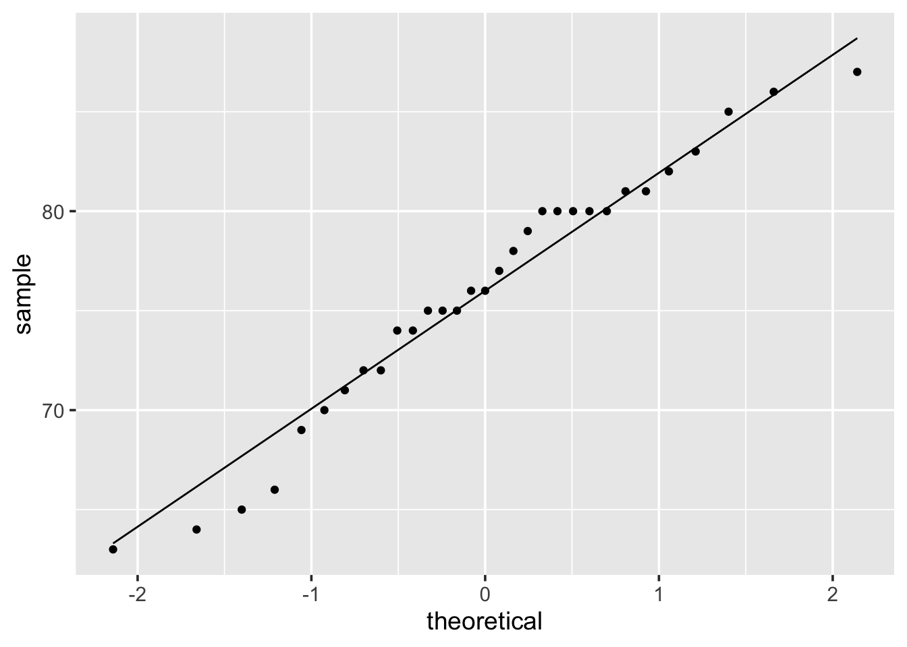
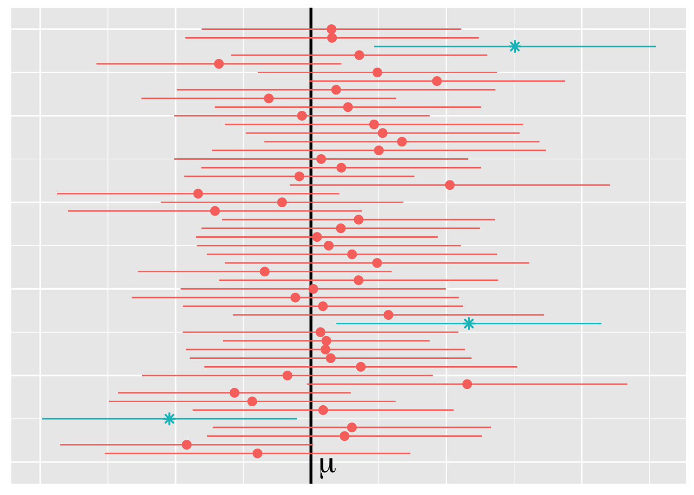

\newcommand{\Var}{\operatorname{Var}}
\newcommand{\E}{\operatorname{E}}
\newcommand{\se}{\mathsf{se}}

# Basics of statistical inferences {#statistical-inference}

We discuss point estimation, confidence intervals, and hypothesis testing in Sections \@ref(point-estimation), \@ref(confidence-intervals), and \@ref(hypothesis-testing), respectively. These three tools will form the basis for making inferences about a population.

## Point estimation {#point-estimation}

Statistical inference seeks to draw conclusions about the characteristics of a population from data. For example, suppose we are botanists interested in taxonomic classification of iris flowers. Let $\mu$ denote the true average petal length (in cm) of the [*Iris setosa*](https://www.wikiwand.com/en/Iris_setosa) (AKA the bristle-pointed iris). The parameter $\mu$ is a characteristic of the whole population of the *setosa* species. Before we collect data, the petal lengths of $m$ independent *setosa* flowers are denoted by rvs $X_1, X_2, \dots, X_m$. Any function of the $X_i$'s, such as the sample mean,
\begin{equation}
  \overline{X} = \frac{1}{m} \sum_{i=1}^m X_i\,, (\#eq:sample-mean)
\end{equation}
or the sample variance,
\begin{equation*}
  S^2 = \frac{1}{m-1} \sum_{i=1}^m (X_i - \overline{X})^2 \,, (\#eq:sample-var)
\end{equation*}
is also a rv. 

Suppose we actually find and measure the petal length of $50$ independent *setosa* flowers resulting in observations $x_1, x_2, \dots, x_{50}$; the distribution (counts) of $50$ such petal length measurements are displayed in Figure \@ref(fig:setosa-petal-lengths). The sample mean $\overline{x}$ for petal length can then be used to draw a conclusion about the (true) value of the population mean $\mu$. Based on the data in Figure \@ref(fig:setosa-petal-lengths) and using \@ref(eq:sample-mean), the value of the sample mean is $\overline{x} = 1.462$. The value $\overline{x}$ provides a "best guess" or point estimate for the true value of $\mu$ based on the $m=50$ samples. 

(\#fig:setosa-petal-lengths)The distribution (counts) of $m = 50$ *setosa* petal length measurments.

> The botonist Edgar Anderson's **Iris Data** contains 50 obs. of four features (sepal length [cm], sepal width [cm], petal length [cm], and petal width [cm]) for each of three plant species (*setosa*, *virginica*, *versicolor*) for 150 obs. total. This data set can be accessed in `r` by loading `library(datasets)` and then calling `data(iris)`. 

\BeginKnitrBlock{definition}
<strong>(\#def:point-estimate) </strong>A **point estimate** of a parameter $\theta$ (recall: a fixed, unknown quantity) is a single number that we regard as a sensible value for $\theta$. Consider iid $X_1, X_2, \dots, X_m \sim F(\theta)$. A **point estimator** $\widehat{\theta}_m$ of $\theta$ is obtained by selecting a suitable statistic $g$,
\begin{equation*}
  \widehat{\theta}_n = g(X_1, \dots, X_m) \,.
\end{equation*}
A point estimate $\widehat{\theta}_m$ can then be computed from the estimator using sample data.
\EndKnitrBlock{definition}

> ⚠️  The symbol $\widehat{\theta}_m$ (or simply $\widehat{\theta}$ when the sample size $m$ is clear from context) is typically used to denote both the estimator and the point estimate resulting from a given sample. Note that writing, e.g., $\widehat{\theta} = 42$ does not indicate how the point estimate was obtained. Therefore, it is essential to report both the estimator and the resulting point estimate. 

Definition \@ref(def:point-estimate) does not say how to select an appropriate statistic. For the *setosa* example, the sample mean $\overline{X}$ is suggested as a good estimator of the population mean $\mu$. That is, $\widehat{\mu} = \overline{X}$ or "the point estimator of $\mu$ is the sample mean $\overline{X}$". Here, while $\mu$ and $\sigma^2$ are fixed quantities representing characteristics of the population, $\overline{X}$ and $S^2$ are rvs with sampling distributions. If the population is *normally distributed* or if the *sample is large* then the sampling distribution for $\overline{X}$ has a known form: $\overline{X}$ is normal with mean $\mu_{\overline{X}} = \mu$ and variance $\sigma_{\overline{X}}^2 = \sigma^{2} / m$, i.e.,
\begin{equation*}
  \overline{X} \sim \mathsf{N}(\mu, \sigma^{2} / m) \,,
\end{equation*}
where $m$ is the sample size and $\mu$ and $\sigma$ are the (typically unknown) population parameters.

\BeginKnitrBlock{example}
<strong>(\#exm:eg-estimators) </strong>Let us consider the heights (measured in inches) of $31$ black cherry trees (sorted, for your enjoyment) in Table \@ref(tab:cherry-data).
\EndKnitrBlock{example}

<table>
<caption>(\#tab:cherry-data)Observations of $m = 31$ felled black cherry trees.</caption>
 <thead>
  <tr>
   <th style="text-align:left;"> Height [in] </th>
  </tr>
 </thead>
<tbody>
  <tr>
   <td style="text-align:left;"> 63, 64, 65, 66, 69, 70, 71, 72, 72, 74, 74, 75, 75, 75, 76, 76, 77, 78, 79, 80, 80, 80, 80, 80, 81, 81, 82, 83, 85, 86, 87 </td>
  </tr>
</tbody>
</table>

> The **Cherry Tree Data** contains 31 obs. of three features (diameter, height, and volume) and can be accessed in `r` by loading `library(datasets)` and then calling `data(trees)`.  

The quantile-quantile plotcomparing the quantiles of this data to the quantiles of a normal distribution, is fairly straight.^[
How do we tell whether a population is normal? Constructing a normal quantile-quantile plot is one way of assessing whether a normality assumption is reasonable; such a plot compares the quantiles of the sample data $x_i$ against the (theoretical) standard normal quantiles. If the sample data is consistent with a sample from a normal distribution, then the points will lie on a straight line (more or less). Below we display the QQ plot comparing quantiles of cherry tree heights from \@ref(tab:cherry-data) to normal quantiles.

] Therefore, we assume that the distribution of black cherry tree heights is (at least approximately) normal with a mean value $\mu$; i.e., that the population of heights is distributed $\mathsf{N}(\mu, \sigma^2)$ where $\mu$ is a parameter to be estimated and $\sigma^2$ is unknown. The observations $X_1, \dots, X_{31}$ are then assumed to be a random sample from this normal distribution, i.e., iid
\begin{equation*}
\quad X_1, \dots, X_{31} \sim \mathsf{N}(\mu, \sigma^2) \,.
\end{equation*}
Consider the following three different stimators and the resulting point estimates for $\mu$ based on the $31$ samples.

a. Estimator (sample mean) $\overline{X}$ as in \@ref(eq:sample-mean) and estimate $\overline{x} = \sum x_i / n = 2356 / 31 = 76$.

b. Estimator (average of extreme heights) $\widetilde{X} = [\min(X_i) + \max(X_i)]/2$ and estimate $\widetilde{x} = (63 + 87)/2 = 75$. 

c. Estimator ($10\%$ trimmed mean -- i.e., in this instance exclude the smallest and largest three values) $\overline{X}_{\text{tr}(10)}$ and estimate $\overline{x}_{\text{tr}(10)} = (2356 - 63 - 64 - 65 - 87 - 86 - 85) / 25 = 76.24$. 

Each estimator above uses a different notion of center for the sample data, i.e., a different statistic. An interesting question to think about is: which estimator will tend to produce estimates closest to the true parameter value? Will the estimators work universally well for all distributions? $\lozenge$
 

In addition to reporting a point estimate together with its estimator, some indication of its precision should be given. One measure of the precision of an estimate is its standard error.  

\BeginKnitrBlock{definition}
<strong>(\#def:standard-error) </strong>The **standard error** of an estimator $\widehat{\theta}$ is the standard deviation 
\begin{equation*}
\sigma_{\widehat{\theta}} = \sqrt{\Var(\widehat{\theta})}\,.
\end{equation*}
Often, the standard error depends on unknown parameters and must also be estimated. The **estimated standard error** is denoted by $\widehat{\sigma}_{\widehat{\theta}}$ or simply $s_{\widehat{\theta}}$.^[The standard error is sometimes denoted $\se = \se(\widehat{\theta})$ and the estimated standard error by $\widehat{\se}$.]
\EndKnitrBlock{definition}

## Confidence intervals {#confidence-intervals}

An alternative to reporting a point estimate for a parameter is to report an interval estimate suggesting an entire range of plausible values for the parameter of interest. A confidence interval is an interval estimate that makes a probability statement about the degree of reliability, or the confidence level, of the interval. The first step in computing a confidence interval is to select the confidence level $\alpha$. A popular choice is a $95\%$ confidence interval which corresponds to level $\alpha = 0.05$.  

\BeginKnitrBlock{definition}
<strong>(\#def:confidence-interval-gen) </strong>A $100(1-\alpha)\%$ **confidence interval** for a parameter $\theta$ is a *random* interval $C_m = (L_m , U_m)$, where $L_m = \ell(X_1, \dots, X_m)$ and $U_m = u(X_1, \dots, X_m)$ are functions of the data, such that 
\begin{equation}
P_{\theta}(L_m < \theta < U_m ) = 1 - \alpha\,, 
\end{equation}
for all $\theta \in \Theta$. 
\EndKnitrBlock{definition}

My favorite interpretation of a confidence interval is due to [@Wasserman:2013as, p 92]:  

> On day 1, you collect data and construct a 95 percent confidence interval for a parameter $\theta_1$. On day 2, you collect new data and construct a 95 percent confidence interval for an unrelated parameter $\theta_2$. On day 3, you collect new data and construct a 95 percent confidence interval for an unrelated parameter $\theta_3$. You continue this way constructing confidence intervals for a sequence of unrelated parameters $\theta_1$, $\theta_2$, $\dots$ Then 95 percent of your intervals will trap the true parameter value. There is no need to introduce the idea of repeating the same experiment over and over.  

This interpretation makes clear that a confidence interval is not a probability statement about the parameter $\theta$. In Definition \@ref(def:confidence-interval-gen), note that $\theta$ is fixed ($\theta$ is not a rv) and the interval $C_m$ is random. After data has been collected and a point estimator has been calculated, the resulting CIs either contain the true parameter value or they do not, as illustrated in Figure \@ref(fig:fifty-cis). 

(\#fig:fifty-cis)Fifty $95\%$ CIs for a population mean $\mu$. After a sample is taken, the computed interval estimate either contains $\mu$ or it does not (asterisk identify intervals that do not include $\mu$). When drawing such a large number of $95\%$ CIs, we would anticipate that approximately $5\%$ (ca. 2 or 3) would fail to cover the true parameter $\mu$.

## Hypothesis testing {#hypothesis-testing}

In Sections \@ref(point-estimation) and \@ref(confidence-intervals) we reviewed how to estimate a parameter by a single number (point estimate) or range of plausible values (confidence interval), respectively. Next we discuss methods for determining which of two contradictory claims, or **hypotheses**, about a parameter is correct. 

\BeginKnitrBlock{definition}
<strong>(\#def:null-alt-hypothesis) </strong>The **null hypothesis**, denoted by $H_0$, is a claim that we intially assume to be true by dafault. The **alternative hypothesis**, denoted by $H_a$, is an assertion that is contradictory to $H_0$. 
\EndKnitrBlock{definition}

The statistical hypothesis are contradictory in that the parameter space is divided into two disjoint sets. For example, for a statistical hypothesis regarding the *equality* of a parameter $\theta$ with a fixed quantity $\theta_0$, the null and alternative hypotheses will take one of the following forms in Table \@ref(tab:htest-null-alt-forms).

<table>
<caption>(\#tab:htest-null-alt-forms)Typical null hypothesis and corresponding alternative hypothesis.</caption>
 <thead>
  <tr>
   <th style="text-align:left;"> Null hypothesis </th>
   <th style="text-align:left;"> Alternative hypothesis </th>
   <th style="text-align:left;"> Test form </th>
  </tr>
 </thead>
<tbody>
  <tr>
   <td style="text-align:left;"> $H_0 : \theta = \theta_0$ </td>
   <td style="text-align:left;"> $H_a : \theta \neq \theta_0$ </td>
   <td style="text-align:left;"> two-sided test </td>
  </tr>
  <tr>
   <td style="text-align:left;"> $H_0 : \theta \leq \theta_0$ </td>
   <td style="text-align:left;"> $H_a : \theta \gt \theta_0$ </td>
   <td style="text-align:left;"> one-sided test </td>
  </tr>
  <tr>
   <td style="text-align:left;"> $H_0 : \theta \geq \theta_0$ </td>
   <td style="text-align:left;"> $H_a : \theta \lt \theta_0$ </td>
   <td style="text-align:left;"> one-sided test </td>
  </tr>
</tbody>
</table>

The value $\theta_0$, called the **null value**, separates the alternative from the null. 

\BeginKnitrBlock{definition}
<strong>(\#def:hypothesis-test) </strong>A **hypothesis test** asks if the available data provides sufficient evidence to reject $H_0$. If the observations disagree with $H_0$, then we reject the null hypothesis. If the sample evidence does not strongly contradict $H_0$, then we continue to believe $H_0$. The two possible conclustions of a hypothesis test are: *reject $H_0$* or *fail to reject $H_0$*.^[We comment that *fail to reject $H_0$* is sometimes phrased *retain $H_0$* or (perhaps less accurately) *accept $H_0$*.]  
\EndKnitrBlock{definition}

A procedure for carrying out a hypothesis test is based on specifying two additional items: a test statistic and a corresponding rejection region. A **test statistic** $T$ is a function of the sample data (like an estimator). The decision to reject or fail to reject $H_0$ will involve computing the test statistic. The **rejection region** $R$ is the collection of values of the test statistic for which $H_0$ is to be rejected in favor of the alternative, e.g.,
\begin{equation*}
R = \left\{ x : T(x) > c \right\}\,,
\end{equation*}
where $c$ is referred to as a **critical value**. If a given sample falls in the rejection region, then we reject $H_0$. That is, if $X \in R$ (e.g., the calculated test statistic exceeds some critical value), then we reject $H_0$. The alternative is that $X \not\in R$ and in this case we fail to reject the null. 

When carrying out a hypothesis test, two types of errors can be made. The basis for choosing a rejection region involves considering these errors. 

\BeginKnitrBlock{definition}
<strong>(\#def:error-types) </strong>A **type I** error occurs if $H_0$ is rejected when $H_0$ is actually true. A **type II** error is made if we fail to reject $H_0$ when $H_0$ is actually false.
\EndKnitrBlock{definition}

If the maximal type I error of a test is fixed at an acceptably small value, then the type II error decreases as the sample size increases. In particular, a conclusion is reached in a hypothesis test by selecting a **significance level** $\alpha$ for the test linked to the maximal type I error rate. Typically, $\alpha = 0.10$, $0.05$, $0.01$, or $0.001$ is selected for the significance level.

\BeginKnitrBlock{definition}
<strong>(\#def:P-value) </strong>A **$P$-value** is the probability, calculated assuming $H_0$ is true, of obtaining a value of the test statistic at least as contradictory to $H_0$ as the value calculated from the sample data. 
\EndKnitrBlock{definition}

Smaller $P$-values indicate stronger evidence against $H_0$ in favor of $H_a$. If $P \leq \alpha$ then we reject $H_0$ at significance level $\alpha$. If $P \geq \alpha$ we fail to reject $H_0$ at significance level $\alpha$.   

>  ⚠️  The $P$-value is a probability calculated assuming that $H_0$ is true. However, the $P$-value is *not*: (1) the probability that $H_0$ is TRUE, (2) the probability that $H_0$ is FALSE, or (3) the probability that a wrong conclusion is reached.   

\BeginKnitrBlock{proposition}
<strong>(\#prp:signifiance-type1) </strong>The hypothesis test procedure that 
\begin{equation*}
\begin{cases} 
\text{rejects}\; H_0 & \text{if}\; P \leq \alpha\\
\text{fails to reject}\; H_0 & \text{otherwise}
\end{cases}
\end{equation*}
has $P(\text{type I error}) = \alpha$. 
\EndKnitrBlock{proposition}

\BeginKnitrBlock{example}
<strong>(\#exm:htest-setup) </strong>Churchill claims that he gain a plurality of the votes for the House of Commons seat for the constituency of Dundee.^[Sir Winston Churchill was member of Parliament for Dundee from 1908--1922.[[W]](https://www.wikiwand.com/en/Winston_Churchill)] If we do not believe Churchill's claim, then we would seek to test an alternative hypothesis. How should we write down our research hypotheses?
\EndKnitrBlock{example}

If we let $p$ be the fraction of the population voting for Churchill, then we have the null hypothesis (note, the minimum needed for plurality is $50\%$)
\begin{equation*}
 H_0 : p = 0.5 
\end{equation*}
and the alternative hypothesis 
\begin{equation*}
 H_a : p < 0.5 \,.
\end{equation*}
Support for the alternative hypothesis is obtain by showing lack of support for it's converse hypothesis (the null hypothesis).  $\lozenge$

\BeginKnitrBlock{example}
<strong>(\#exm:htest-alpha) </strong>Suppose that $m = 15$ voters are selected from Dundee and $X$, the number favoring Churchill, is recorded. Based on observing $X$, we construct a rejection region $R = \{x : x \leq k \}$. If $k$ is small compared to $m$, then the rejection region would provide pretty strong evidence to reject $H_0$. How should one choose the rejection region?
\EndKnitrBlock{example}

Assume now that $m = 15$ voters are polled and that we select $k = 2$ to have a rejection region $R = \{ x \leq 2 \}$. We can calculate the probability of a type I error. From the definition of type I error,
\begin{equation*}
 \begin{aligned}
 \alpha &= P(\text{type I error})\\
  &= P(\text{rejecting } H_0 \text{ when } H_0 \text{ is true})\\
  &= P(X \in R \text{ when } H_0 \text{ is true})\\
  &= P(X \leq 2 \text{ when } p = 0.5) \,.
 \end{aligned}
\end{equation*}
Since $Y \sim \mathsf{Binom}(15, 0.50)$, we calculate that $\alpha = 0.00369$. Thus, for this particular choice of rejection region $R$, the risk of concluding that Churchill will lose if in fact he is the winner is very small.

For this rejection region, how good is the test at protecting us from type II errors, i.e., concluding that Churchill is the winner if in fact he will lose? Suppose that Churchill receive $25%$ of the votes ($p=0.25$). The probability of a type II error $\beta$,
\begin{equation*}
  \begin{aligned}
  \beta &= P(\text{type II error})\\
  &= P(\text{fail to reject } H_0 \text{ when } H_0 \text{ false})\\
  &= P(X \not\in R \text{ when } H_0 \text{ false})\\
  &= P(X > 2 \text{ when } p = 0.3)\,.
 \end{aligned}
\end{equation*}
For $Y \sim \mathsf{Binom}(15, 0.25)$, we calculate $\beta = 0.764$. If we use $R = \{ x \leq 2\}$ then our test will lead us to conclude that Churchill is the winner with probability $0.764$ even if $p$ is as low as $0.25$!

If we repeat these caclculations for $R^* = \{x \leq 5\}$, we find $\alpha = 0.151$ versus $\beta = 0.148$, even if $p$ is as low as $0.25$, which is a much better balance between type I and type II errors. $\lozenge$   

To summarize, the elements of a statistical test are:  

1. Null hypothesis ($H_0$)
2. Alternative hypothesis ($H_a$)
3. Test statistic
4. Rejection region  
5. Significance level ($\alpha$)

***  
