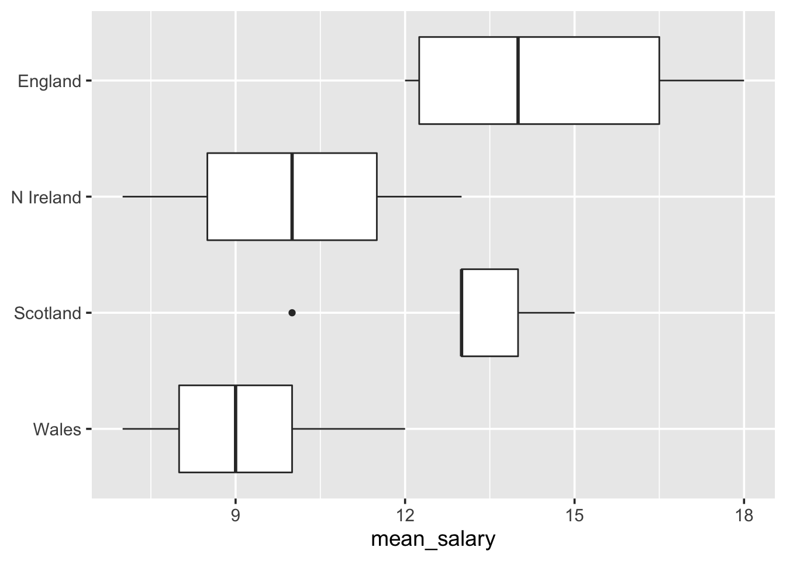

\newcommand{\Var}{\operatorname{Var}}
\newcommand{\E}{\operatorname{E}}
\newcommand{\se}{\mathsf{se}}

# Analysis of variance (ANOVA) {#anova}

Analysis of variance, shortened as ANOVA, is a collection of statistical models and estimation procedures for analyzing the variation among different groups. In particular, a single-factor ANOVA provides a hypothesis test regarding the equality of two or more population means, thereby generalizing the one-sample and two-sample $\mathsf{t}$ tests considered in Sections \@ref(mean-normal-var-unknown) and \@ref(compare-means-normpops-vars-unknown).

## Single factor ANOVA test {#anova-single-factor-test}

Suppose that we have $k$ normally distributed populations^[In the context of ANOVA, these $k$ populations are often referred to as **treatment distributions**.] with different means $\mu_1, \dots, \mu_k$ and equal variances $\sigma^2$. We denote the rv for the $j$th measurement taken from the $i$th population by $X_{ij}$ and the corresponding sample observation by $x_{ij}$. For samples of size $m_1, \dots, m_k$, we denote the sample means
\begin{equation*}
 \overline{X}_i = \frac{1}{m_i} \sum_{j=1}^{m_i} X_{ij}\,, 
\end{equation*}
and sample variances 
\begin{equation*}
 S_i^2 = \frac{1}{m_i - 1} \sum_{j=1}^{m_i} (X_{ij} - \overline{X}_{i})^2\,,
\end{equation*}
for each $i = 1, \dots, k$; likewise, we denote the associated point estimates for the sample means $\overline{x}_1, \dots, \overline{x}_k$ and the sample variances $s_1^2, \dots, s_k^2$. The average over all observations $m = \sum m_i$, called the **grand mean**, is denoted by 
\begin{equation*}
 \overline{X} = \frac{1}{m} \sum_{i=1}^k \sum_{j=1}^{m_i} X_{ij}\,.
\end{equation*} 
The sample variances $s_i^2$, and hence the sample standard deviations, will generally vary even when the $k$ populations share the same variance; a rule of thumb is that the equality of variances is reasonable if the largest $s_i$ is not much more than two times the smallest. 

We wish to test the equality of the population means, given by the null hypothesis,
\begin{equation*}
 H_0 : \mu_1 = \mu_2 = \cdots = \mu_k\,,
\end{equation*}
versus the alternative hypothesis,
\begin{equation*}
 H_a : \text{at least two}\; \mu_i \; \text{differ}\,.
\end{equation*}
Note that if $k=3$ then $H_0$ is true only if all three means are the same, i.e., $\mu_1 = \mu_1 = \mu_3$, but there are a number of ways which the alternative might hold: $\mu_1 \neq \mu_2 = \mu_3$ or $\mu_1 = \mu_2 \neq \mu_3$ or $\mu_1 = \mu_3 \neq \mu_2$ or $\mu_1 \neq \mu_2 \neq \mu_3$. 

The test procedure is based on comparing a measure of difference in variation among the sample means, i.e., the variation between $x_i$'s, to a measure of variation within each sample.  

\BeginKnitrBlock{definition}<div class="definition"><span class="definition" id="def:mstr-mse"><strong>(\#def:mstr-mse) </strong></span>The **mean square for treatments** is 
\begin{equation*}
 \mathsf{MSTr} = \frac{1}{k-1} \sum_{i=1}^k m_i (\overline{X}_i - \overline{X})^2\,,
\end{equation*}
and the **mean square error** is 
\begin{equation*}
 \mathsf{MSE} = \frac{1}{m-k} \sum_{i=1}^k (m_i - 1) S_i^2 \,.
\end{equation*}
The $\mathsf{MSTr}$ and $\mathsf{MSE}$ are statistics that measure, respectively, the variation among sample means and the variation within samples. We will also use $\mathsf{MSTr}$ and $\mathsf{MSE}$ to denote calculated values of these statistics. </div>\EndKnitrBlock{definition}

\BeginKnitrBlock{proposition}<div class="proposition"><span class="proposition" id="prp:htest-anova"><strong>(\#prp:htest-anova) </strong></span>The test statistic 
\begin{equation*}
F = \frac{\mathsf{MSTr}}{\mathsf{MSE}} 
\end{equation*}
is the appropriate test statistic for the single-factor ANOVA problem involving $k$ populations (or treatments) with a random sample of size $m_1, \dots, m_k$ from each. When $H_0$ is true, 
\begin{equation*}
F \sim \mathsf{F}(\nu_1 = k-1, \nu_2 = m - k)\,.
\end{equation*}
In the present context a large test statistic value is more constradictory to $H_0$ than a smaller value, therefore the test is upper-tailed, i.e., consider the area $F_\alpha$ to the right of the critical value $F_{\alpha, \nu_1, \nu_2}$. We reject $H_0$ if the value of the test statistic $F > F_\alpha$.</div>\EndKnitrBlock{proposition}


\BeginKnitrBlock{example}<div class="example"><span class="example" id="exm:anova"><strong>(\#exm:anova) </strong></span>Consider the average salary data from lcocal councils in Table \@ref(tab:anova-samples-stats). Is the expected average salary in each nation the same at the $5\%$ level?</div>\EndKnitrBlock{example}

<table>
<caption>(\#tab:anova-samples-stats)Data and summary sample statistics for Figure \@ref(fig:anova-samples-boxplots).</caption>
 <thead>
  <tr>
   <th style="text-align:left;"> Nation </th>
   <th style="text-align:left;"> Average salaries ('000 £) </th>
   <th style="text-align:center;"> Size $(m_i)$ </th>
   <th style="text-align:center;"> Sample Mean $(\overline{x}_i)$ </th>
   <th style="text-align:center;"> Sample SD $(s_i)$ </th>
  </tr>
 </thead>
<tbody>
  <tr>
   <td style="text-align:left;"> England </td>
   <td style="text-align:left;"> 17, 12, 18, 13, 15, 12 </td>
   <td style="text-align:center;"> 6 </td>
   <td style="text-align:center;"> 14.5 </td>
   <td style="text-align:center;"> 2.588 </td>
  </tr>
  <tr>
   <td style="text-align:left;"> N Ireland </td>
   <td style="text-align:left;"> 11, 7, 9, 13 </td>
   <td style="text-align:center;"> 4 </td>
   <td style="text-align:center;"> 10.0 </td>
   <td style="text-align:center;"> 2.582 </td>
  </tr>
  <tr>
   <td style="text-align:left;"> Scotland </td>
   <td style="text-align:left;"> 15, 10, 13, 14, 13 </td>
   <td style="text-align:center;"> 5 </td>
   <td style="text-align:center;"> 13.0 </td>
   <td style="text-align:center;"> 1.871 </td>
  </tr>
  <tr>
   <td style="text-align:left;"> Wales </td>
   <td style="text-align:left;"> 10, 12, 8, 7, 9 </td>
   <td style="text-align:center;"> 5 </td>
   <td style="text-align:center;"> 9.2 </td>
   <td style="text-align:center;"> 1.924 </td>
  </tr>
</tbody>
</table>

> Table \@ref(tab:anova-samples-stats) presents the average salaries (in thousands of pounds) reported from 20 local councils classified by nation (England, N Ireland, Scotland, and Wales). The sample means together with the sample standard deviations are summarized in the table as well as presented using using box plots in Figure \@ref(fig:anova-samples-boxplots).  


<div class="figure">

<p class="caption">(\#fig:anova-samples-boxplots)Box plots of the average mean salary data in Table \@ref(tab:anova-samples-stats) indicate five summary statistics: the median, two hinges (first and third quartiles) and two whiskers (extending from the hinge to the most extreme data point within 1.5 * IQR).</p>
</div>

For $\alpha = 0.05$, we compute the upper-tail area $F_{0.05}$ i.e. to the right of the critical value $F_{0.05, 3, 16}$ by consulting a statistical table or by using `r`:


```r
qf(1-.05, df1 = 4-1, df2 = 20-4) # alt: qf(.05, df1 = 4-1, df2 = 20-4, lower.tail = FALSE)
```

```
[1] 3.238872
```

to find $F_{0.05} = 3.2388715$.  
 
The grand mean is 
\begin{equation*}
 \overline{x} = \frac{17 + 12 + 18 + \cdots + 8 + 7 + 9}{20} = 11.9\,,
\end{equation*}
and hence the variation among sample means is given by,
\begin{equation*}
\begin{aligned}
 \mathsf{MSTr} &= \frac{1}{4-1} \left(m_1(\overline{x}_1 - \overline{x})^2 + \cdots + m_4 (\overline{x}_4 - \overline{x})^2\right) \\
 &= \left(6 (14.5-11.9)^2 + 4(10.0 - 11.9)^2 + 5(13.0-11.9)^2 + 5 ( 9.2 - 11.9)^2\right) / 3 \\
 &= 32.5 \,.
\end{aligned}
\end{equation*}
The mean square error is
\begin{equation*}
 \begin{aligned}
 \mathsf{MSE} & = \frac{1}{20-4} \left((m_1 - 1)s_1^2 + \cdots (m_4-1)s_4^2\right)\\ 
  &= \frac{5(2.588)^2 + 3(2.582)^2 + 4(1.871)^2 + 4(1.924)^2}{16} \\
  &= 5.14366
 \end{aligned}
\end{equation*}
yielding the test statistic value
\begin{equation*}
 F = \frac{\mathsf{MSTr}}{\mathsf{MSE}} = \frac{32.5}{5.14366} 
 = 6.3184581 \,.
\end{equation*}
Since $F > F_\alpha$ we reject $H_0$. The data does not support they hypothesis that the mean salaries in each nation are identical at the $5\%$ level. $\lozenge$    

## Confidence intervals {#anova-ci}

In Section \@ref(compare-means) we gave a CI for comparing population means that involved the difference $\mu_X - \mu_Y$. In some settings, we would like to give CIs for more complicated functions of population means $\mu_i$. Let
\begin{equation*}
 \theta = \sum_{i=1}^k c_i \mu_i\,,
\end{equation*}
for constants $c_i$. As we assume the $X_ij$ are normally distributed with $\E[X_{ij}] = \mu_i$ and $\Var[X_{ij}] = \sigma^2$, the estimator
\begin{equation*}
 \widehat{\theta} = \sum_{i=1}^k c_i \overline{X}_{i}\,,
\end{equation*}
is normally distributed with
\begin{equation*}
 \Var[\widehat{\theta}] - \sum_{i=1}^k c_i^2 \Var[\overline{X}_i] = \sigma^2 \sum_{i=1}^{k} \frac{c_i}{m_i}\,.
\end{equation*}
Estimating $\sigma^2$ by the \mathsf{MSE} and forming $\widehat{\sigma}_{\widehat{\theta}}$ results in a $\mathsf{t}$ variable
\begin{equation*}
 \frac{\widehat{\theta} - \theta}{\widehat{\sigma}_{\widehat{\theta}}}\,.
\end{equation*}

\BeginKnitrBlock{proposition}<div class="proposition"><span class="proposition" id="prp:ci-anova"><strong>(\#prp:ci-anova) </strong></span>A $100(1-\alpha)\%$ CI for $\sum c_i \mu_i$ is given by 
\begin{equation*}
 \sum_{i=1}^k c_i \overline{x}_i \pm t_{\alpha/2, m-k} \sqrt{\mathsf{MSE} \sum_{i=1}^k \frac{c_i}{m_i}}\,.
\end{equation*}</div>\EndKnitrBlock{proposition}

\BeginKnitrBlock{example}<div class="example"><span class="example" id="exm:anova-ci"><strong>(\#exm:anova-ci) </strong></span>Determine a $90\%$ CI for the difference in mean average salary for councils in Scotland and England, based on the data available in Table \@ref(tab:anova-samples-stats)</div>\EndKnitrBlock{example}

For $\alpha = 0.10$, the critical value $t_{0.05, 16} = 1.7458837$ is found by looking in a table of $\mathsf{t}$ critical values or by using `r`:


```r
qt(1-0.1/2, df = 20 - 4) # alt: qt(0.1/2, 16, lower.tail = FALSE)
```

```
[1] 1.745884
```

Then for the function $\overline{x}_2 - \overline{x_1}$, 
\begin{equation*}
\begin{aligned}
(\overline{x}_{Eng} - \overline{x}_{Sco}) \pm& t_{0.05, 16} \sqrt{\mathsf{MSE}} \sqrt{\frac{1}{m_{Eng}} + \frac{1}{m_{Sco}}} \\
& = (14.5 - 13.0) \pm 1.7458837 \sqrt{5.14366} \sqrt{\frac{1}{6} + \frac{1}{5}} \\
& = 1.5 \pm 2.3976575\,.
\end{aligned}
\end{equation*}
Thus a $90\%$ confidence interval for $\mu_{Eng} - \mu_{Sco}$ is $(-0.8976575\,, 3.8976575)$. $\lozenge$   

> How does this result compare to the method in Section \@ref(compare-means-normpops-vars-unknown)?
