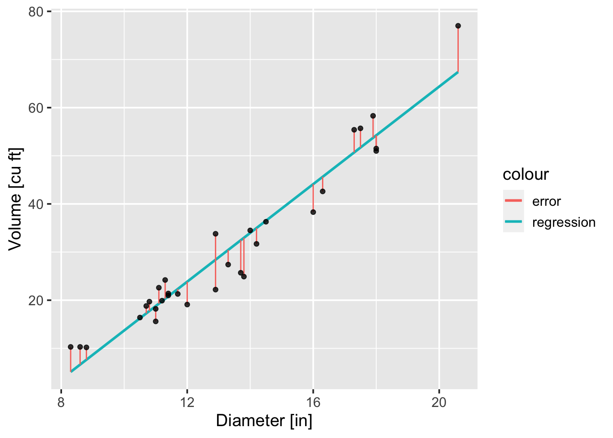
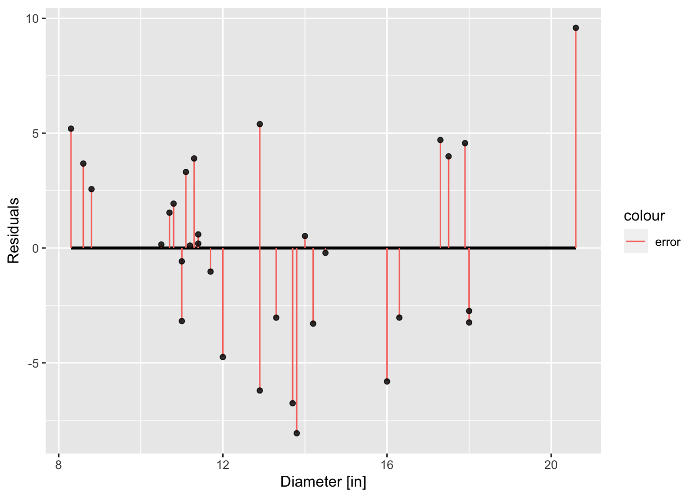
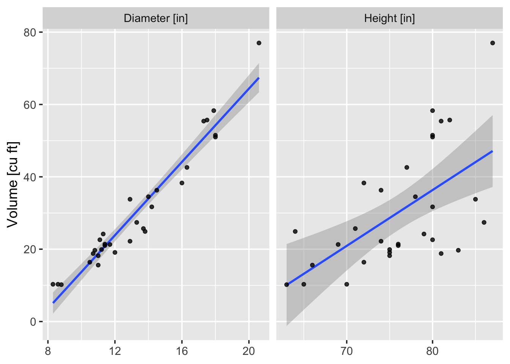

\newcommand{\Cov}{\operatorname{Cov}}
\newcommand{\Var}{\operatorname{Var}}
\newcommand{\E}{\operatorname{E}}
\newcommand{\se}{\mathsf{se}}

# Linear regression {#linear-models}

**Regression analysis** allows us to study the relationship among two or more rvs. Typically, we are interested in the relationship between a **response** or **dependent** rv $Y$ and a **covariate** $X$.^[The covariates $X$ are also called **predictor variables**, **explanatory variables**, **independent variables**, and/or **features** depending on who you are talking to.] The relationship between $X$ and $Y$ will be explained through a **regression function**, 
\begin{equation*}
 r(x) = \E[Y \mid X = x] = \int y f(y\mid x) dy \,.
\end{equation*}
In particular, we shall assume that $r$ is linear,
\begin{equation}
 r(x) = \beta_0 + \beta_1 x\,,
 (\#eq:linear-regression-function)
\end{equation}
and estimate the intercept $\beta_0$ and slope $\beta_1$ of this linear model from sample data 
\begin{equation*}
 (Y_1, X_1), \dots, (Y_m, X_m) \sim F_{Y,X}\,.
\end{equation*}

## Simple linear regression models

The simplest regression is when $X_i$ is one-dimensional and $r(x)$ is linear as in \@ref(eq:linear-regression-function). A linear regression posits the expected value of $Y_i$ is a linear function of the data $X_i$, but that $Y$ deviates from its expected value by a random amount for fixed $x_i$. 

\BeginKnitrBlock{definition}<div class="definition"><span class="definition" id="def:linear-model"><strong>(\#def:linear-model) </strong></span>The **simple linear regression model** relates a random response $Y_i$ to a set of independent variables $X_i$,
\begin{equation}
 Y_i = \beta_0 + \beta_1 X_i + \epsilon_i \,,
 (\#eq:linear-model)
\end{equation}
where the intercept $\beta_0$ and slope $\beta_1$ are unknown parameters and the **random deviation** or **random error** $\epsilon_i$ is a rv assumed to satisfy:
 
1. $\E[\epsilon_i \mid X_i = x_i] = 0$,
2. $\Var[\epsilon_i \mid X_i = x_i] = \sigma^2$ does not depend on $x_i$,
3. $\epsilon_i$ and $\epsilon_j$ are independent for $i, j = 1, \dots, m$. </div>\EndKnitrBlock{definition}

From the assumptions on $\epsilon_i$, the linear model \@ref(eq:linear-model) implies
\begin{equation*}
 \E[Y_i \mid X_i = x_i] = \beta_0 + \beta_1 x_i \,.
\end{equation*}
Thus, if $\widehat{\beta}_0$ and $\widehat{\beta}_1$ are estimators of $\beta_0$ and $\beta_1$, then the **fitted line** is
\begin{equation*}
 \widehat{r}(x) = \widehat{\beta}_0 + \widehat{\beta}_1 x
\end{equation*}
and the **predicted** or **fitted value** $\widehat{Y}_i = \widehat{r}(X_i)$ is an estimator for $\E[Y_i \mid X_i = x_i]$. The **residuals** are defined to be
\begin{equation}
 \widehat{\epsilon}_i = Y_i - \widehat{Y}_i = Y_i - \left( \widehat{\beta}_0 + \widehat{\beta}_1 X_i \right) \,.
 (\#eq:ls-residuals)
\end{equation}
The **residual sums of squares**,^[The $\mathsf{RSS}$ is sometimes referred to as the **error sum of squares** and abbreviated $\mathsf{SSE}$ (no, that isn't a typo).]
\begin{equation}
 \mathsf{RSS} = \sum_{i=1}^m \widehat{\epsilon}_i^2\,,
 (\#eq:rss)
\end{equation}
measures how well the regression line $\widehat{r}$ fits the data $(Y_1, X_1), \dots, (Y_m, X_m)$. The **least squares estimates** of $\widehat{\beta}_0$ and $\widehat{\beta}_1$ are the values that minimize the $\mathsf{RSS}$ in \@ref(eq:rss).

\BeginKnitrBlock{theorem}<div class="theorem"><span class="theorem" id="thm:least-squares-estimates"><strong>(\#thm:least-squares-estimates) </strong></span>The **least squares estimates** for $\widehat{\beta}_1$ and $\widehat{\beta}_0$ are given by, respectively,
\begin{equation}
 \widehat{\beta}_1 = \frac{\sum_{i=1}^m (X_i - \overline{X})(Y_i - \overline{Y})}{\sum_{i=1}^m (X_i - \overline{X})^2} = \frac{S_{xy}}{S_{xx}} \,,
 (\#eq:ls-slope)
\end{equation}
and
\begin{equation}
 \widehat{\beta}_0 = \overline{Y} - \widehat{\beta}_1 \overline{X}\,.
 (\#eq:ls-intercept)
\end{equation}</div>\EndKnitrBlock{theorem}

Note that \@ref(eq:rss) is a function of $\widehat{\beta}_0$ and $\widehat{\beta}_1$ from the definition of the residuals \@ref(eq:ls-residuals). Then \@ref(eq:ls-slope) and \@ref(eq:ls-intercept) follow by equating the partial derivatives of \@ref(eq:rss) to zero. The $\widehat{\beta}_0$ and $\widehat{\beta}_1$ are the unique solution to this linear system.

\BeginKnitrBlock{example}<div class="example"><span class="example" id="exm:linear-model-fit-residuals"><strong>(\#exm:linear-model-fit-residuals) </strong></span>In Figure \@ref(fig:linear-model-fit), we consider the **Cherry Tree Data** (see Table \@ref(tab:cherry-data) and discussion). We fit a least squares regression of the volume of timber (response variable) to the diameter of the tree (independent variable). As you would expect, the volume of timber yielded from a tree increases with its diameter.</div>\EndKnitrBlock{example}

The `r` code below can be used to calculate the least squares regression and residuals. 

```r
data(trees)
y <- trees$Volume
x <- trees$Girth # NB: this is diameter; data mislabeled!
fit <- lm(y ~ x)
e <- resid(fit)
yhat <- predict(fit)
```
The `fit` data frame contains the estimates for $\widehat{\beta}_0$ and $\widehat{\beta}_1$:


```r
fit$coefficients
```

```
(Intercept)           x 
 -36.943459    5.065856 
```

In Figure \@ref(fig:linear-model-fit), the regression line is `yhat` plotted against `x` and the error bars indicate the least squares residuals, i.e., the difference `y - yhat`. The residuals are presented a second way in Figure \@ref(fig:linear-model-residuals).  $\lozenge$   

<div class="figure">

<p class="caption">(\#fig:linear-model-fit)Linear regression (or least squares fit) of Volume to Diameter from the **Cherry Tree Data**. The vertical bars between the observed data point and the regression line indicate the error in the fit (the least squares residual).</p>
</div>

<div class="figure">

<p class="caption">(\#fig:linear-model-residuals)The residuals of the least squares fit of Volume to Diameter plotted in Figure \@ref(fig:linear-model-fit).</p>
</div>


## Estimating $\sigma^2$ for linear regressions

The parameter $\sigma^2$ (the variance of the random deviation) determines the variability in the regression model.   

\BeginKnitrBlock{theorem}<div class="theorem"><span class="theorem" id="thm:least-squares-var-estimate"><strong>(\#thm:least-squares-var-estimate) </strong></span>An unbiased estimate of $\sigma^2$ is given by
\begin{equation}
 \widehat{\sigma}^2 = s^2 = \frac{\mathsf{RSS}}{m-2} = \frac{1}{m-2} \sum_{i=1}^m (y_i - \widehat{y}_i)^2\,.
 (\#eq:least-squares-var-estimate)
\end{equation}</div>\EndKnitrBlock{theorem}

In Figure \@ref(fig:linear-model-sigma-large-v-small), we present a least squares regression of timber volume on both tree diameter and height (for the **Cherry Tree Data**). As expected, the regressions indicate the volume increases with both covariates. Estimates for the variance of the random deviation \@ref(eq:least-squares-var-estimate) in both regression models, $\sigma_{D}^2$ and $\sigma_{H}^2$, respectively, are computed to be $s^2_{D} = 18.08$ and $s^2_{H} = 179.48$. Thus, we see that small variances lead to observations of $(x_i, y_i)$ that sit tightly around the regression line, in contrast to large variances that lead to a large cloud of points. 

<div class="figure">

<p class="caption">(\#fig:linear-model-sigma-large-v-small)For the **Cherry Tree Data**, we estimate the variance to be $s^2_{D} = 18.08$ (for Diameter) and $s^2_{H} = 179.48$ (for Height); small variances lead to observations of $(x_i, y_i)$ that sit tightly around the regression line, in contrast to large variances that lead to a large cloud of points.</p>
</div>

> In Theorem \@ref(thm:least-squares-var-estimate), the number in the denominator is the df associated with the $\mathsf{RSS}$ and $s^2$. To calculate $\mathsf{RSS}$ you must estimate two parameters $\beta_0$ and $\beta_1$ which results in the loss of two df. Hence the $m-2$.   

We note for the purposes of making inferences, the statistic 
\begin{equation*}
 S^2 = \frac{\mathsf{RSS}}{m-2}
\end{equation*}
is an unbiased estimator or $\sigma^2$ and the random variable 
\begin{equation*}
 \frac{(m-2) S^2}{\sigma^2} \sim \chi^2(m-2)\,.
\end{equation*}
Moreover, the statistic $S^2$ is independent of both $\widehat{\beta}_0$ and $\widehat{\beta}_1$. 


## Inferences for least-squares estimators

If $\epsilon_i$ in \@ref(eq:linear-model) is assumed to be normally distributed, then we can derive the sampling distributions of the estimators $\widehat{\beta}_0$ and $\widehat{\beta}_1$. Hence, we can use these sampling distributions to make inferences about the parameters $\beta_0$ and $\beta_1$. 

Provided iid $\epsilon_i \mid X_i \sim \mathsf{N}(0, \sigma^2)$, the least-squares estimators possess the following properties.   

1. Both $\widehat{\beta}_0$ and $\widehat{\beta}_1$ are normally distributed. 
2. Both $\widehat{\beta}_0$ and $\widehat{\beta}_1$ are unbiased, i.e., $\E[\widehat{\beta}_i] = \beta_i$ for $i = 0,1$. 
3. $\Var[\widehat{\beta}_0] = c_{00} \sigma^2$ where $c_{00} = \sum_{i=1}^m x_i^2 / (m S_{xx})$.
4. $\Var[\widehat{\beta}_1] = c_{11} \sigma^2$ where $c_{11} = 1/S_{xx}$. 
5. $\Cov[\widehat{\beta}_0, \widehat{\beta}_1] = c_{01} \sigma^2$ where $c_{01} = - \overline{x} / S_{xx}$.   

These properties can be determined by working directly from \@ref(eq:ls-slope) and \@ref(eq:ls-intercept).   

\BeginKnitrBlock{proposition}<div class="proposition"><span class="proposition" id="prp:htest-ls-betas"><strong>(\#prp:htest-ls-betas) </strong></span>To test the null hypothesis $H_0 : \beta_i = \beta_{i0}$ against the alternatives
\begin{equation*}
H_a : \begin{cases} 
\beta_i > \beta_{i0} & \text{upper-tail RR} \\ 
\beta_i < \beta_{i0} & \text{lower-tail RR} \\ 
\beta_i \neq \beta_{i0} & \text{two-tailed RR}
\end{cases}
\end{equation*}
Test statistic:
\begin{equation*}
 T = \frac{\widehat{\beta}_i - \beta_{i0}}{S\sqrt{c_{ii}}}
\end{equation*}
where $t_\alpha$ is based on $m-2$ df.</div>\EndKnitrBlock{proposition}

\BeginKnitrBlock{proposition}<div class="proposition"><span class="proposition" id="prp:ci-ls-betas"><strong>(\#prp:ci-ls-betas) </strong></span>A $100(1-\alpha)\%$ CI for $\beta_i$ is given by 
\begin{equation*}
 \widehat{\beta}_i \pm t_{\alpha/2, m-2} S \sqrt{c_{ii}} \,.
\end{equation*}</div>\EndKnitrBlock{proposition}


## Correlation

Let $(X_1, Y_1), \dots, (X_m, Y_m)$ denote a random sample from a bivariate normal distribution with $\E[X_i] = \mu_X$, $\E[Y_i] = \mu_Y$, $\Var[X_i] = \sigma_X^2$, $\Var[Y_i] = \sigma_Y^2$, and correlation coefficient $\rho$. The sample correlation coefficient is given by,
\begin{equation*}
 r = \frac{\sum_{i=1}^m (X_i - \overline{X})(Y_i - \overline{Y})}{\sqrt{\sum_{i=1}^m (X_i - \overline{X})^2 \sum_{i=1}^m (Y_i - \overline{Y})^2}}\,,
\end{equation*}
which can be rewritten in terms of $S_{xx}$, $S_{xy}$, and $S_{yy}$:
\begin{equation*}
 r = \frac{S_{xy}}{\sqrt{S_{xx}S_{yy}}} = \widehat{\beta}_1 \sqrt{\frac{S_{xx}}{S_{yy}}}\,,
\end{equation*}
using \@ref(eq:ls-slope) and we see that $r$ and $\widehat{\beta}_1$ have the same sign. A $|r|$ close to $1$ means that the regression line is a good fit to the data and, similarly, an $|r|$ close to $0$ means a poor fit to the data. 

```{}
**TODO**: insert plots for correlation coefficients and interpretation
```   

Once a model is fit, it can be used to predict a value of $y$ for a given $x$. However, the model only gives the most likely value of $y$; a corresponding **prediction interval** is usually more appropriate. 

\BeginKnitrBlock{proposition}<div class="proposition"><span class="proposition" id="prp:prediction-interval"><strong>(\#prp:prediction-interval) </strong></span>A $100(1-\alpha)\%$ **prediction interval** for an actual value of $Y$ when $x = x^*$ is given by 
\begin{equation*}
 (\widehat{\beta}_0 + \widehat{\beta}_1 x^*) \pm t_{\alpha/2, m-2} S \sqrt{1 + \frac{1}{n} + \frac{(x^* - \overline{x})^2}{S_{xx}}} \,.
\end{equation*}</div>\EndKnitrBlock{proposition}

> ⚠️ The prediction interval is not the same as the confidence interval for expected $Y$. Note that the length of the *confidence interval* for $\E[Y]$ when $x=x^*$ is given by 
\begin{equation*}
 2 \cdot t_{\alpha/2} S  \sqrt{\frac{1}{n} + \frac{(x^* - \overline{x})^2}{S_{xx}}}
\end{equation*}
whereas the length for the *prediction interval* of $Y$ is 
\begin{equation*}
 2 \cdot t_{\alpha/2} S  \sqrt{1 + \frac{1}{n} + \frac{(x^* - \overline{x})^2}{S_{xx}}} \,.
\end{equation*}
Thus the prediction intervals for an actual value of $Y$ are longer than the confidence intervals for $\E[Y]$ if both are determined for the same value $x^*$.   

The linear model 
\begin{equation*}
 \E[ Y \mid X = x ] = \beta_0 + \beta_1 x \,, 
\end{equation*}
assumes that the conditional expectation of $Y$ for a fixed value of $X$ is a linear function of the $x$ value. If we assume that $(X,Y)$ has a bivariate normal distribution, then 
\begin{equation*}
 \beta_1 = \frac{\sigma_Y}{\sigma_X} \rho \,,
\end{equation*}
and thus, for the simple hypothesis tests we have considered (Table \@ref(tab:htest-null-alt-forms)), statistical tests for $\beta$ and $\rho$ are equivalent.

