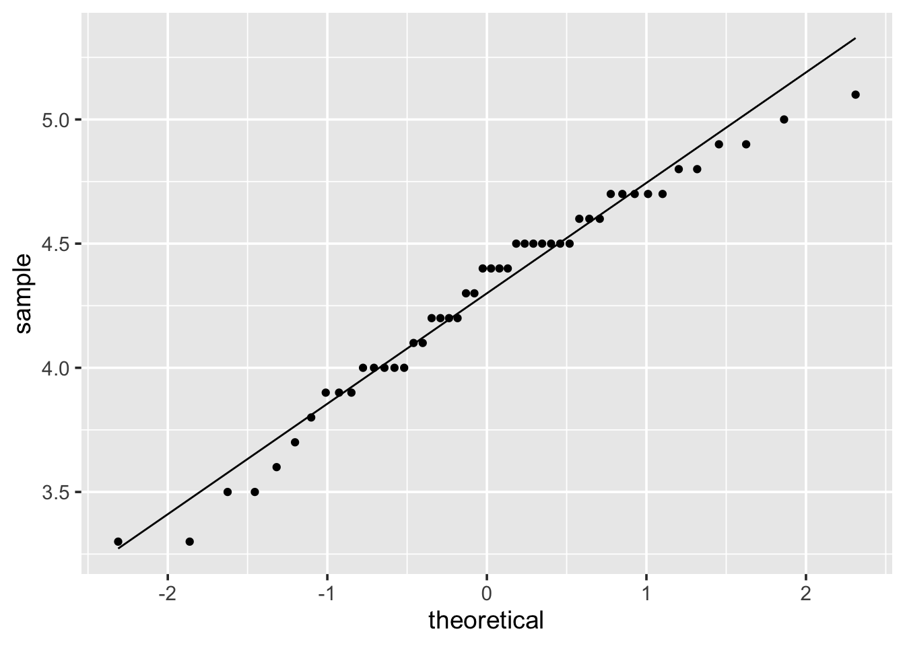
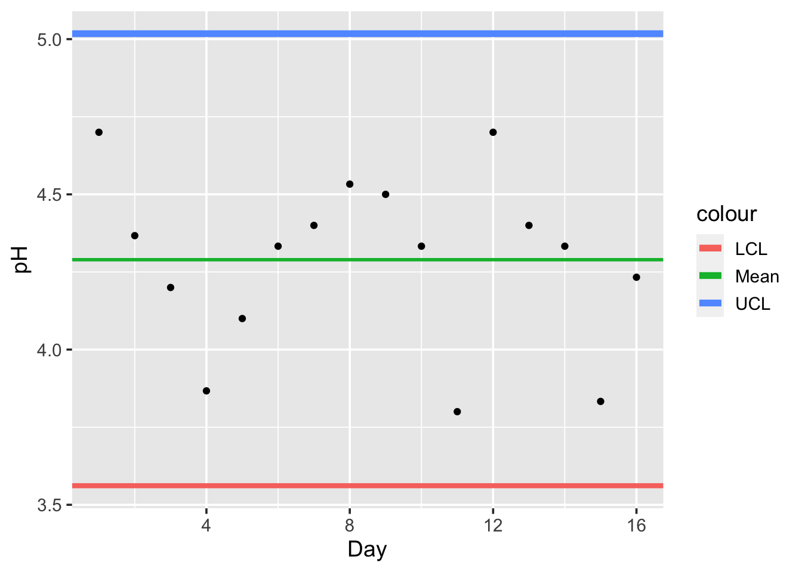

<!-- \newcommand{\Var}{\operatorname{Var}} -->
<!-- \newcommand{\E}{\operatorname{E}} -->
<!-- \newcommand{\se}{\mathsf{se}} -->

# Quality Control {#quality-control}


Quality control is an area of applies statistics that seeks to make interventions to maintain or improve the outcome of industrial processes. Random variations in output processes might negatively impact the quality of a product. We would like to identify the sources of random variations in output processes that might have *assignable causes*. **Control charts** are a tool that help us to recognize when industrial processes are no longer controlled so that one might then seek to identify assignable causes. 

The basic elements of control charting involve specifying a control region and then analyzing time-series data. We will specify a base-line value along with an upper and lower limit of control and assume that a process is under control unless a test statistic suggests otherwise.^[The default position here will be reminiscent of hypothesis testing.] To construct a control chart, one collects data about a process at fixed points of time and calculates the running value of quality statistic. If the quality statistic exceeds the upper or lower control limits, the process is deemed to out of control and the quality of the product is assumed to be negatively impacted. 

The process of creating a control chart is best illustrated through an extended example, like Example \@ref(exm:qc-three-sigma) provided below. 

\BeginKnitrBlock{example}<div class="example"><span class="example" id="exm:qc-three-sigma"><strong>(\#exm:qc-three-sigma) </strong></span>Here we  consider the typical $3 \sigma$ control charting for a process mean $\overline{X}$ based on estimated parameters. That is, we assume the generating process $X$ is normally distributed with unknown parameters $\mu$ and $\sigma^2$. We seek to estimate the mean $\overline{X}$. Our control region is specified to be three standard deviations; that is, the process is in-control if it remains within three standard devaitions of a baseline value.</div>\EndKnitrBlock{example}

The **Beer Data** contains measurements of the features OG, ABV, pH, and IBU for $50$ batches of each of three types of product (Premium Lager, IPA, and Light Lager). We are interested the IPA's pH value, which influences saccharification. We assume that 3 batches of IPA are produced per day are we prepare the data as follows.


```r
ipa <- beer %>% 
 select(Batch_Id, pH, Beer) %>% 
 filter(Beer == "IPA") %>% 
 rename(Day = Batch_Id)
ipa$Day[1:48] <- rep(1:16, each = 3)
ipa <- ipa[1:48,]
m <- 3    # three batches per day
k <- 16   # number of days
```

We first observe that the pH measurements are (at least approximately) normal, as can be seen from the quantile-quantile plot in Figure \@ref(fig:qc-beer-pH-norm).   


```r
ggplot(ipa, aes(sample = pH)) + stat_qq() + stat_qq_line()
```

<div class="figure">

<p class="caption">(\#fig:qc-beer-pH-norm)Normal quantile-quantile plot of observed pH measurements of the IPA batches in Table \@ref(tab:qc-beer-data).</p>
</div>

We consider the data for pH readings from three batches of IPA taken over sixteen days ($k = 16$) presented in Table \@ref(tab:qc-beer-data). The Table includes the sample mean per day $\overline{x}$, the sample standard deviation $s$, and the range of values $\max{x_i} - \min{x_i}$ per day (each based on $m=3$ batches).   


```r
ipa_stat <- ipa %>% 
 group_by(Day) %>% 
 summarise(observations = list(pH), mean = signif(mean(pH), digits = 4), 
           sd = signif(sd(pH), digits = 4), range = max(pH) - min(pH))
kable(ipa_stat, align = "llccc", 
      caption = "Observations and summary statistics for the **Beer Data**.",
      col.names = c('Day', "pH Observations", '$\\overline{x}$', '$s$', 'Range'))
```

<table>
<caption>(\#tab:qc-beer-data)Observations and summary statistics for the **Beer Data**.</caption>
 <thead>
  <tr>
   <th style="text-align:left;"> Day </th>
   <th style="text-align:left;"> pH Observations </th>
   <th style="text-align:center;"> $\overline{x}$ </th>
   <th style="text-align:center;"> $s$ </th>
   <th style="text-align:center;"> Range </th>
  </tr>
 </thead>
<tbody>
  <tr>
   <td style="text-align:left;"> 1 </td>
   <td style="text-align:left;"> 4.7, 4.5, 4.9 </td>
   <td style="text-align:center;"> 4.700 </td>
   <td style="text-align:center;"> 0.20000 </td>
   <td style="text-align:center;"> 0.4 </td>
  </tr>
  <tr>
   <td style="text-align:left;"> 2 </td>
   <td style="text-align:left;"> 4.0, 4.6, 4.5 </td>
   <td style="text-align:center;"> 4.367 </td>
   <td style="text-align:center;"> 0.32150 </td>
   <td style="text-align:center;"> 0.6 </td>
  </tr>
  <tr>
   <td style="text-align:left;"> 3 </td>
   <td style="text-align:left;"> 4.7, 3.3, 4.6 </td>
   <td style="text-align:center;"> 4.200 </td>
   <td style="text-align:center;"> 0.78100 </td>
   <td style="text-align:center;"> 1.4 </td>
  </tr>
  <tr>
   <td style="text-align:left;"> 4 </td>
   <td style="text-align:left;"> 3.9, 3.5, 4.2 </td>
   <td style="text-align:center;"> 3.867 </td>
   <td style="text-align:center;"> 0.35120 </td>
   <td style="text-align:center;"> 0.7 </td>
  </tr>
  <tr>
   <td style="text-align:left;"> 5 </td>
   <td style="text-align:left;"> 4.0, 4.7, 3.6 </td>
   <td style="text-align:center;"> 4.100 </td>
   <td style="text-align:center;"> 0.55680 </td>
   <td style="text-align:center;"> 1.1 </td>
  </tr>
  <tr>
   <td style="text-align:left;"> 6 </td>
   <td style="text-align:left;"> 4.4, 4.5, 4.1 </td>
   <td style="text-align:center;"> 4.333 </td>
   <td style="text-align:center;"> 0.20820 </td>
   <td style="text-align:center;"> 0.4 </td>
  </tr>
  <tr>
   <td style="text-align:left;"> 7 </td>
   <td style="text-align:left;"> 4.5, 3.9, 4.8 </td>
   <td style="text-align:center;"> 4.400 </td>
   <td style="text-align:center;"> 0.45830 </td>
   <td style="text-align:center;"> 0.9 </td>
  </tr>
  <tr>
   <td style="text-align:left;"> 8 </td>
   <td style="text-align:left;"> 4.0, 4.9, 4.7 </td>
   <td style="text-align:center;"> 4.533 </td>
   <td style="text-align:center;"> 0.47260 </td>
   <td style="text-align:center;"> 0.9 </td>
  </tr>
  <tr>
   <td style="text-align:left;"> 9 </td>
   <td style="text-align:left;"> 4.3, 4.4, 4.8 </td>
   <td style="text-align:center;"> 4.500 </td>
   <td style="text-align:center;"> 0.26460 </td>
   <td style="text-align:center;"> 0.5 </td>
  </tr>
  <tr>
   <td style="text-align:left;"> 10 </td>
   <td style="text-align:left;"> 5.0, 4.5, 3.5 </td>
   <td style="text-align:center;"> 4.333 </td>
   <td style="text-align:center;"> 0.76380 </td>
   <td style="text-align:center;"> 1.5 </td>
  </tr>
  <tr>
   <td style="text-align:left;"> 11 </td>
   <td style="text-align:left;"> 3.8, 3.7, 3.9 </td>
   <td style="text-align:center;"> 3.800 </td>
   <td style="text-align:center;"> 0.10000 </td>
   <td style="text-align:center;"> 0.2 </td>
  </tr>
  <tr>
   <td style="text-align:left;"> 12 </td>
   <td style="text-align:left;"> 5.1, 4.5, 4.5 </td>
   <td style="text-align:center;"> 4.700 </td>
   <td style="text-align:center;"> 0.34640 </td>
   <td style="text-align:center;"> 0.6 </td>
  </tr>
  <tr>
   <td style="text-align:left;"> 13 </td>
   <td style="text-align:left;"> 4.7, 4.4, 4.1 </td>
   <td style="text-align:center;"> 4.400 </td>
   <td style="text-align:center;"> 0.30000 </td>
   <td style="text-align:center;"> 0.6 </td>
  </tr>
  <tr>
   <td style="text-align:left;"> 14 </td>
   <td style="text-align:left;"> 4.0, 4.4, 4.6 </td>
   <td style="text-align:center;"> 4.333 </td>
   <td style="text-align:center;"> 0.30550 </td>
   <td style="text-align:center;"> 0.6 </td>
  </tr>
  <tr>
   <td style="text-align:left;"> 15 </td>
   <td style="text-align:left;"> 4.0, 3.3, 4.2 </td>
   <td style="text-align:center;"> 3.833 </td>
   <td style="text-align:center;"> 0.47260 </td>
   <td style="text-align:center;"> 0.9 </td>
  </tr>
  <tr>
   <td style="text-align:left;"> 16 </td>
   <td style="text-align:left;"> 4.2, 4.2, 4.3 </td>
   <td style="text-align:center;"> 4.233 </td>
   <td style="text-align:center;"> 0.05774 </td>
   <td style="text-align:center;"> 0.1 </td>
  </tr>
</tbody>
</table>

We estimate of the mean  
\begin{equation*}
 \widehat{\mu} = \frac{1}{k} \sum_{i=1}^k \overline{x}_i \,,
\end{equation*}
by averaging the means found for the $k$ days and, similarly, estimate the mean of the sample standard deviation,
\begin{equation*}
 \overline{s} = \frac{1}{k} \sum_{i=1}^k s_i\,,
\end{equation*}
by averaging the sample standard deviations for the $k$ days. It can be shown that 
\begin{equation*}
 \widehat{\sigma} = \frac{\overline{S}}{a_m} 
\end{equation*}
is an unbiased estimator of $\sigma$ where
\begin{equation*}
a_m = \frac{\sqrt{2} \Gamma(m/2)}{\sqrt{m-1}\Gamma\left((n-1)/2\right)}\,.
\end{equation*}
Thus, we compute the $3\sigma$ upper and lower control limits, respectively,
\begin{equation*}
 \mathsf{UCL} = \widehat{\mu} + 3 \frac{\overline{s}}{a_m \sqrt{m}}
\end{equation*}
and 
\begin{equation*}
 \mathsf{LCL} = \widehat{\mu} - 3 \frac{\overline{s}}{a_m \sqrt{m}} \,.
\end{equation*}
The computations in `r` follow, along with the resulting **control chart** in Figure \@ref(fig:qc-beer-control-chart).   


```r
a <- function(m){ sqrt(2) * gamma(m/2) / (sqrt(m-1) * gamma((m-1)/2)) }
muhat = sum(ipa_stat$mean) / k
sbar = sum(ipa_stat$sd) / k
lcl = muhat - 3*sbar / (a(m) * sqrt(m))
ucl = muhat + 3*sbar / (a(m) * sqrt(m))

ggplot(ipa_stat, aes(x = Day)) + geom_point(aes(y = mean)) + 
 geom_hline(aes(yintercept = muhat, color = "Mean"), size = 1) + 
 geom_hline(aes(yintercept = lcl, color = "LCL"), size = 1.5) + 
 geom_hline(aes(yintercept = ucl, color = "UCL"), size = 2) + ylab("pH")
```

<div class="figure">

<p class="caption">(\#fig:qc-beer-control-chart)The $3\sigma$ **control chart** illustrates that with respect to pH the brewing process is in-control over the selected timeframe as the observations fall within the $(\mathsf{LCL}, \mathsf{UCL})$ control interval.</p>
</div>

From Figure \@ref(fig:qc-beer-control-chart), we observe for each day the process is in-control as the observed mean pH values fall within the control limits $(\mathsf{LCL}, \mathsf{UCL})$. If this were not the case, then our initial assumption, that process is in-control, would be violated. The violation of the assumption would require that we seek to identify an assignable cause for the variation. If a cause could be identified, then the we would need to recompute our control limits with the observations that were out of control removed. $\lozenge$
