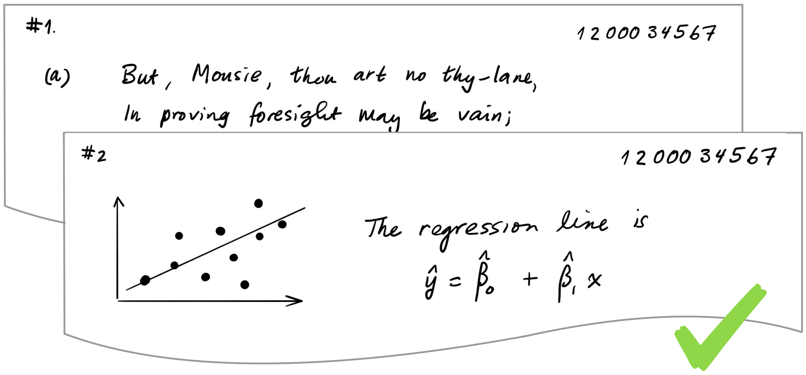
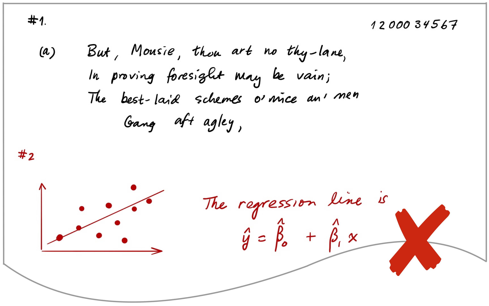
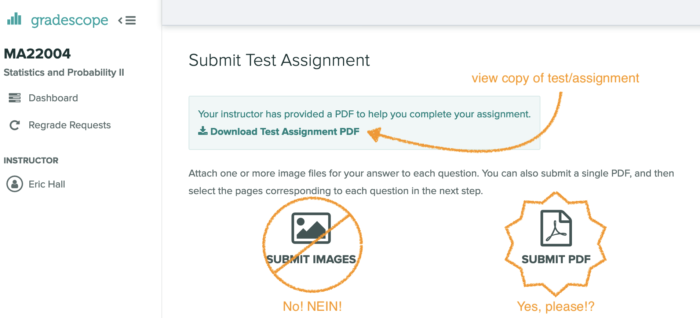
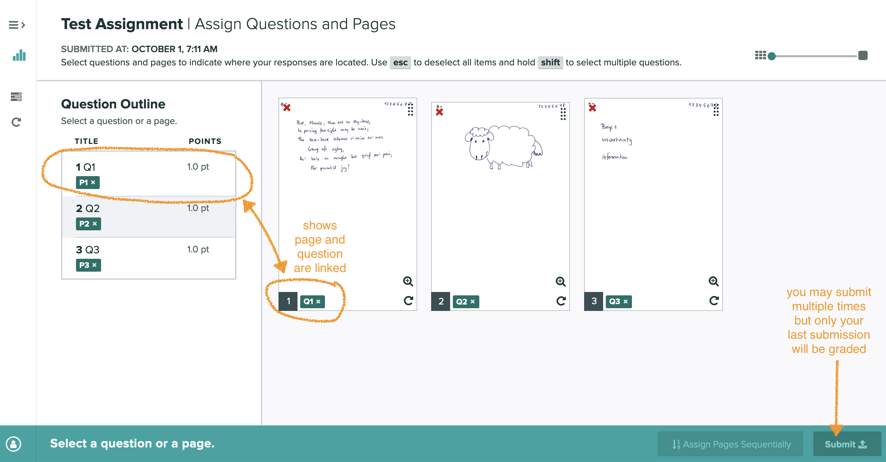
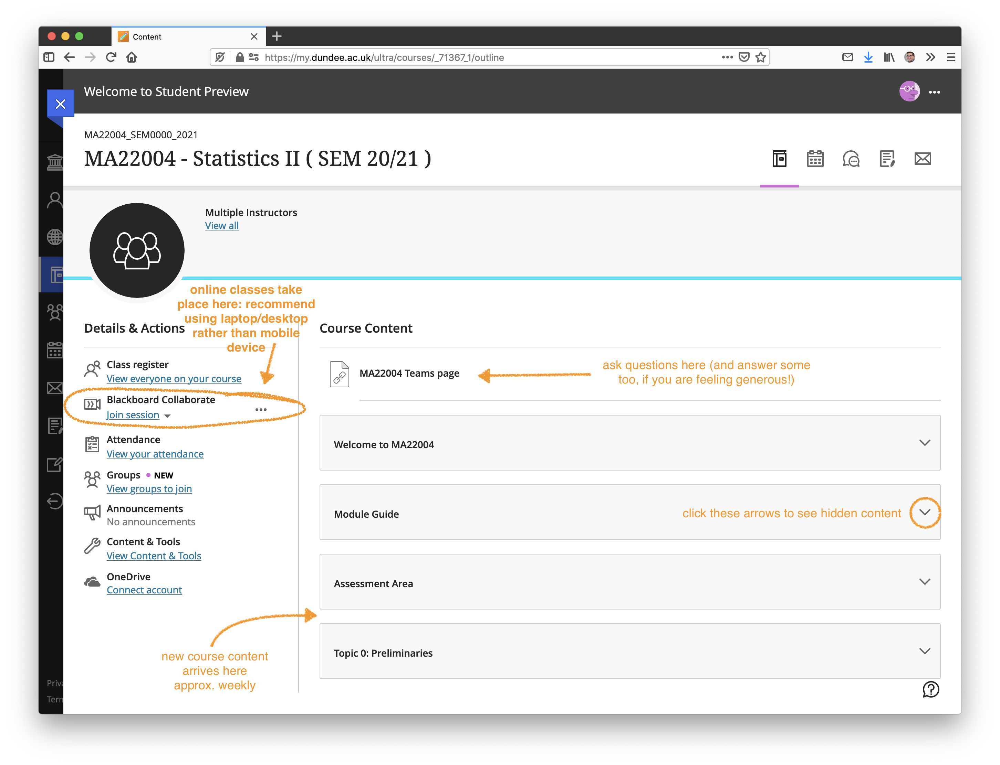

# Instructions {-#instructions}

## Gradescope Class Test Submissions {-}

These instructions will help you prepare a single multipage PDF file of your Class Test to submit via Gradescope.

### Equipment you will need {-#equipment}

#### Writing on paper  {-}

- Write on light-colored paper. This can be blank, lined, or squared. 
- Use a blue or black pen.
- You will need a mobile phone/table with a document scanning app. 

Two (free) apps available for phone/table that will enable you to scan documents and create a PDF are:

- Adobe Scan
- Microsoft Office Lens

The apps all work in largely the same way: you take a photo of the page; the app processes this; you export to PDF.

#### Writing on tablet  {-}

- If you have access to a tablet, you may use this as long as you can produce a single PDF. 
- Remember to charge your device. 
- Good idea to be ready with pen and paper as backup. 


### Submission workflow {-#workflow}

\faIcon{edit} `r fa("edit")` Write your work 
\hspace*{1em} \faIcon{long-arrow-alt-right} `r fa("long-arrow-alt-right")` 
\hspace*{1em} \faIcon{file-pdf} `r fa("file-pdf")` Create a PDF of your work 
\hspace*{1em} \faIcon{long-arrow-alt-right} `r fa("long-arrow-alt-right")` 
\hspace*{1em} \faIcon{cloud-upload-alt} `r fa("cloud-upload-alt")` Upload and Zone your work 

#### Step 1. Write your work \hspace*{1em}\faIcon{edit} `r fa("edit")` {-#step1}

The goal is to simulate the (joyous) experience of writing an in-person class test as closely as possible. 

- At the **top of each page**, write the **question number** on at the top left and your **student number** at the top right. 

- Start your answer to each question on a fresh sheet of paper. This will make zoning easier. 

```{r gradescope-good, fig.margin = TRUE, echo = FALSE, fig.cap="Good practice---each page contains a separate question with question number at top left and student number at top right.", out.width = "75%", fig.align = "center", fig.pos="h"}

```
<!--  -->

```{r gradescope-not-good, fig.margin = TRUE, echo = FALSE, fig.cap="Not good practice---please avoide placing two questions on the same page.", out.width = "75%", fig.align = "center", fig.pos="h"}

```
<!--  -->


#### Step 2. Create a PDF of your work \hspace*{1em}\faIcon{file-pdf} `r fa("file-pdf")` {-#step2}

- If you are using a tablet and can directly create a PDF of your submission, go to Step [3](step3).

- If you are using paper, please scan 

##### Scanning tips {-}

- **Do not just take a picture of your work with your phone's camera app. Please create a good quality PDF.**

- Place each page on a flat surface, ideally of a different color to the paper you have written on, and create a single PDF containing all the pages you wish to submit.


#### Step 3. Upload and Zone your work  \hspace*{1em}\faIcon{cloud-upload-alt} `r fa("cloud-upload-alt")` {-#step3}

- Log into Gradescope (first time: use the course access code on Blackboard).
- Select the course and then the appropriate assignment. 
- Select submit PDF (shown below).
- After uploading your PDF, please zone your work by identifying the first page that each question starts on (see below).
- You may submit multiple times until the due date, but only your last submission will be seen and graded.

```{r gradescope-submit, fig.margin = TRUE, echo = FALSE, fig.cap="Please submit a PDF on Gradescope.", out.width = "100%", fig.align = "center", fig.pos="h"}

```   

<!--  -->

```{r gradescope-zone, fig.margin = TRUE, echo = FALSE, fig.cap="Please zone your submission by associating each question to a page on Gradescope.", out.width = "100%", fig.align = "center", fig.pos="h"}

```   

<!--  -->


## Using Blackboard {-}

Note that we will meet for synchronous online sessions using Blackboard Collaborate. You must log into Blackboard Ultra, navigate to the course page, and then select "Join session" in the left-hand column. 

```{r bbultra-overview, fig.margin = TRUE, echo = FALSE, fig.cap="An annotated overview of the Blackboard Ultra course landing page.", out.width = "100%", fig.align = "center", fig.pos="h"}

```   
