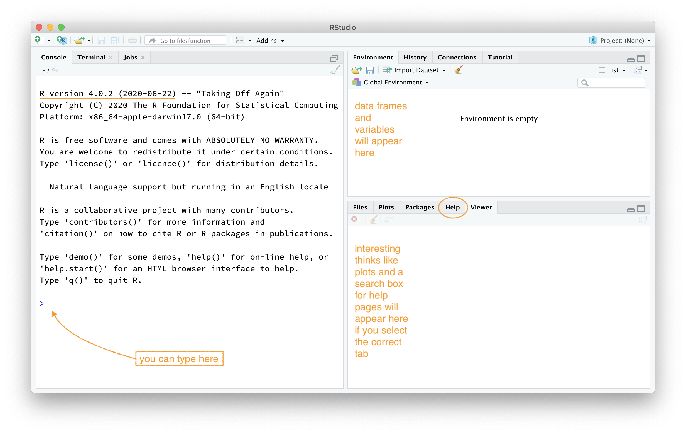

```{css, echo=FALSE}
body {
    counter-reset: li; /* initialize counter named li */
}

ol {
    margin-left:0; /* Remove the default left margin */
    padding-left:0; /* Remove the default left padding */
}
ol > li {
    position:relative; /* Create a positioning context */
    margin:0 0 10px 2em; /* Give each list item a left margin to make room for the numbers */
    padding:10px 80px; /* Add some spacing around the content */
    list-style:none; /* Disable the normal item numbering */
    border-top:2px solid #317EAC;
    background:rgba(49, 126, 172, 0.1);
}
ol > li:before {
    content:"Exercise " counter(li); /* Use the counter as content */
    counter-increment:li; /* Increment the counter by 1 */
    /* Position and style the number */
    position:absolute;
    top:-2px;
    left:-2em;
    -moz-box-sizing:border-box;
    -webkit-box-sizing:border-box;
    box-sizing:border-box;
    width:7em;
    /* Some space between the number and the content in browsers that support
       generated content but not positioning it (Camino 2 is one example) */
    margin-right:8px;
    padding:4px;
    border-top:2px solid #317EAC;
    color:#fff;
    background:#317EAC;
    font-weight:bold;
    font-family:"Helvetica Neue", Arial, sans-serif;
    text-align:center;
}
li ol,
li ul {margin-top:6px;}
ol ol li:last-child {margin-bottom:0;}

.oyo ul {
    list-style-type:decimal;
}

hr {
    border: 1px solid #357FAA;
}

div#boxedtext {
    background-color: rgba(86, 155, 189, 0.2);
    padding: 20px;
    margin-bottom: 20px;
    font-size: 10pt;
}

div#template {
    margin-top: 30px;
    margin-bottom: 30px;
    color: #808080;
    border:1px solid #808080;
    padding: 10px 10px;
    background-color: rgba(128, 128, 128, 0.2);
    border-radius: 5px;
}

div#license { 
    margin-top: 30px;
    margin-bottom: 30px;
    color: #4C721D;
    border:1px solid #4C721D;
    padding: 10px 10px;
    background-color: rgba(76, 114, 29, 0.2);
    border-radius: 5px;
}
```

```{r setup, include=FALSE}
# packages
library(learnr)
library(openintro)
# devtools::install_github("rstudio-education/gradethis")
library(gradethis)
# devtools::install_github("rundel/learnrhash")
# library(learnrhash)

# tutorial options
tutorial_options(
  # code running in exercise times out after 30 seconds
  # if it is taking more than 30 s something is wrong 
  exercise.timelimit = 30,
  # use gradethis for checking
  exercise.checker = gradethis::grade_learnr
  )
options(width = 60)

# hide non-exercise code chunks
knitr::opts_chunk$set(echo = FALSE)
bob <- c("a", "b", "c")
arbuthnot
```


## The RStudio interface

The goal of this lab is to introduce you to R and RStudio, which you'll be using throughout the course both to learn the statistical concepts discussed in the course and to analyze real data and come to informed conclusions. To clarify which is which: `R` is the name of the programming language itself and RStudio is a convenient interface for working with `R` .

As the labs progress, you are encouraged to explore beyond what the labs dictate; a willingness to experiment will make you a much better programmer! Before we get to that stage, however, you need to build some basic fluency in `R`. First, we will explore the fundamental building blocks of `R` and RStudio: the RStudio interface, reading in data, and basic commands for working with data in `R`.

Go ahead and launch RStudio. You should see a window that looks more or less like the image shown below (I've added a few comments).

```{r r-interface-2020, fig.margin = TRUE, echo = FALSE, fig.width = 3, out.width = "100%", fig.cap="A fresh *RStudio* window. Please try to use `R` version **4.0.2 (2020-06-22) \"Taking Off Again\"."}

```

The panel on the lower left is where the action happens. This panel is called the *console*. Every time you launch RStudio, it will have the same text at the top of the console telling you the version of R that you're running. Below that information is the *prompt*, indicated by the `>` symbol. As its name suggests, this prompt is really a request: a request for a command. Initially, interacting with `R` is all about typing commands and interpreting the output. These commands and their syntax have evolved over decades (literally) and now provide what many users feel is a fairly natural way to access data and organize, describe, and invoke statistical computations.

The panel in the upper right contains your *environment* as well as a history of the commands that you've previously entered.

The panel in the lower right contains tabs for browse the *files* in your project folder, access *help* files for `R` functions, install and manage `R` *packages*, and inspecting visualizations. By default, all data visualizations you make will appear directly below the code you used to create them. If you would rather your plots appear in the *plots* tab, you will need to change your global options.


### R Packages

`R` is an open-source programming language, meaning that users can contribute packages that make our lives easier, and we can use them for free. For this lab, and many others in the future, we will use the following:

<!-- -   The **tidyverse** "umbrella" package which houses a suite of many different `R` packages: for data wrangling and data visualization -->
-   The **openintro** `R` package: for data and custom functions with the OpenIntro resources
-   The **learnr** `R` package: for running these interactive lab tutorials
-   The **gradethis** `R` package: to serve you answers to interactive tutorial exercises

In the lower right hand corner click on the *Packages* tab. Type the name of each of these packages (tidyverse, openintro, learnr) into the search box to see if they have been installed. If these packages do not appear when you type in their name, install them by copying and pasting or typing the following two lines of code into the console of your RStudio session. Be sure to press enter/return after each line of code.

```{r install-packages, message = FALSE, eval = FALSE}
install.packages("openintro")
install.packages("learnr")
install.packages("devtools") # to install `gradethis`
devtools::install_github("rstudio-education/gradethis")
```

After pressing enter/return, a stream of text will begin, communicating the process `R` is going through to install the package from the location you selected when you installed `R`. If you were not prompted to select a server for downloading packages when you installed `R`, RStudio may prompt you to select a server from which to download; any of them will work.


### Loading packages

You only need to *install* packages once, but you need to *load* them each time you relaunch RStudio. We load packages with the `library` function. Copy and paste or type the the following two lines in your console to load the tidyverse, openintro, learnr, and gradethis packages into your working environment. 

```{r load-packages, echo = TRUE, exercise = TRUE}
library(openintro)
library(learnr)
library(gradethis)
```

We are choosing to use the tidyverse package because it consists of a set of packages necessary for different aspects of working with data, anything from loading data to wrangling data to visualizing data to analyzing data.
Additionally, these packages share common philosophies and are designed to work together. You can find more about the packages in the tidyverse at [tidyverse.org](http://tidyverse.org/).

## Nuts and bolts

### Entering input

At the most elementary level R works as a fancy calculator. R will evaluate whatever you type at the prompt
and return a result.  For example, try evaluating $5.7^{2}-2.57$ (i.e., fill in/replace the blanks and hit *Run Code* to evaluate your answer and *Submit Answer* for instant feedback).

```{r ex-input-basic, exercise = TRUE}
___
```

```{r ex-input-basic-check}
grade_result(
  pass_if(~ identical(.result[1], 29.92)),
  fail_if(~ TRUE)
)
```

You can also use standard mathematical functions and operations.  

```{r ex-input-basicplus, exercise = TRUE}
sqrt(5) + 3 * sin(pi/2) + 1/4
```

A useful feature of R is its ability to create plots.  These typically appear in RStudio on the lower right hand panel in the Plots tab. Fill in the blank below to generate a scatter plot of **100** random numbers drawn from a Uniform distribution between 0.0 and 5.0:

```{r ex-input-plot, exercise = TRUE}
plot(runif(___, 0.0, 5.0))
```

### Working with arrays

The R language is based on objects which you can create, manipulate and delete.  The most basic object for holding data is called an array and is just an ordered list of things.  These are created using the function `c`. Often these things are numbers.  Fill in the blanks to create an array (suggested variable name `alvin`) containing just three numbers.

```{r ex-input-array, exercise = TRUE}
alvin <- c(___, ___, ___)
```

```{r ex-input-array-check}
grade_result(
  pass_if(~ (length(.result) == 3) & identical(class(.result), "numeric"), 
          "You entered a numeric array of length 3."),
  fail_if(~ !(length(.result) == 3), "Either too many or too few elements."),
  fail_if(~ !identical(class(.result), "numeric"), "Your array is not of type numeric.")
)
```

You can also see the object by typing its name. Try running the code below.

```{r ex-input-array-showbob, exercise = TRUE}
bob <- c("a", "b", "c")
bob
```

You can also output just one element of the array by commands like `var[1]`. Try retrieving the second element of `bob` by filling in the blanks. 

```{r ex-input-array-bob2, exercise = TRUE}
bob[___]
```

```{r ex-input-array-bob2-check}
grade_result(
  pass_if(~ identical(.result,"b"), 
          "Yes, the second element is \"b\".")
)
```

You can use `R` to generate sequences of numbers. See what the following commands do by running the code. Note that for long-ish output, the bracketed numbers at the left correspond to the index of the element that follows.

```{r ex-input-seq1, exercise = TRUE}
c(0:100)
```

```{r ex-input-seq2, exercise = TRUE}
seq(0, 100, by=5)
```

To remove objects from your environment use the `rm()` command.

## Handling data

To illustrate the power of R at handling larger sets of data, lets examine some data on birth records collected by Dr. John Arbuthnot, an 18<sup>th</sup> century physician, writer, and mathematician.  He was interested in the ratio of newborn boys to newborn girls, so he gathered the baptism records for children born in London for every year from 1629 to 1710. We can take a look at this dataset (which is made available by `library(openintro)`) by simply running the following code.

```{r view-data, exercise = TRUE}
arbuthnot
```

What you should see are three columns of numbers. Each row represents a different record that includes the year, the numbers of boys baptized, and the number of girls baptized.

If you load this dataset in the `R` console, note that there will also be row numbers in the first column that are not part of Arbuthnot's data. `R` adds them as part of its printout to help you make visual comparisons. You can think of them as the index that you see on the left side of a spreadsheet. `R` has stored Arbuthnot's data in a kind of spreadsheet or table called a **data frame**.

You can see the dimensions of this data frame by typing:

```{r dim-data, exercise = TRUE}
dim(arbuthnot)
```

This command should output `[1] 82 3`, indicating that there are 82 rows and 3 columns. You can see the names of these columns (or variables) by typing:

```{r names-data, exercise = TRUE}
names(arbuthnot)
```

You should see that the data frame contains the columns `year`,  `boys`, and `girls`. At this point, you might notice that many of the commands in `R` look a lot like functions from math class; that is, invoking `R` commands means supplying a function with some number of arguments. The `dim` and `names` commands, for example, each took a single argument, the name of a data frame. 

### Some exploration

Let's start to examine the data a little more closely. We can access the data in a single column of a data frame separately using a command like

```{r view-boys, eval = FALSE}
arbuthnot$boys
```

This command will only show the number of boys baptized each year.

```{r view-girls}
question(
  "What command would you use to extract just the counts of girls baptized?",
  answer("`arbuthnot$girls`", correct = TRUE),
  answer("`arbuthnot[girls]`", message = "Actually, `arbuthnot['girls']` would also work. But this answer is not that!"),
  answer("`arbuthnot = girls`"),
  answer("`arbuthnot.girls`"),
  allow_retry = TRUE,
  random_answer_order = TRUE
)
```

Notice that the way R has printed these data is different. When we looked at the complete data frame, we saw 82 rows, one on each line of the display. These data are no longer structured in a table with other variables, so they are displayed one right after another. Objects that print out in this way are called *vectors*; they represent a set of numbers. R has added numbers in [brackets] along the left side of the printout to indicate locations within the vector. For example, `5218` follows `[1]`, indicating that `5218` is the first entry in the vector. And if `[43]` starts a line, then that would mean the first number on that line would represent the 43<sup>rd</sup> entry in the vector.

R has some powerful functions for making graphics. Create a simple plot of the number of girls baptized per year with the `plot` command.

```{r plot-girls-vs-year, exercise = TRUE}
plot(x = arbuthnot$year, y = ___)
```


By default, `R` creates a scatterplot with each x,y pair indicated by an open circle. Notice that the command above again looks like a function, this time with two arguments separated by a comma.  The first argument in the plot function specifies the variable for the x-axis and the second for the y-axis. If we wanted to connect the data points with lines, we could supply a third argument, called `type` with the option `"l"` for **l**ine (not a number 1). Fill in the blanks below to produce a line plot. 

```{r plot-girls-vs-year-line, exercise = TRUE}
plot(x = arbuthnot$year, y = arbuthnot$girls, type = ___)
```

You might wonder how you are supposed to know that it was possible to add that third argument.  Thankfully, `R` documents all of its functions extensively. To read what a function does and learn the arguments that are available to you, just type in a question mark followed by the name of the function that you're interested in, e.g. `?plot`, in the console. Or you can use the search box in the Help tab in the lower right-hand pane in the RStudio window.

1.  Generate a plot of year versus count of baptised girls that meets the following requirements. Add a title to the x-axis using the additional argument `xlab="year"`. Also add an appropriate y-axis label and plot title. You may use the "help" menu. **[4 marks]**

```{r answer-1, exercise = TRUE}
plot( ___ )
```

2.  Considering your plot in Exercise 1, is there an apparent trend in the number of girls baptized over the years?  **[2 mark]**

```{r answer-2}
question_text(
  "Enter your solution as free text below.",
  answer("C0rrect", correct = TRUE),
  incorrect = "Okay! [even if this button is red]",
  try_again_button = "Modify your answer",
  allow_retry = TRUE
)
```

### Some further exploration

Now, suppose we want to plot the total number of baptisms.  To compute this, we could use the fact that R is really just a big calculator. We can type in mathematical expressions like

```{r calc-total-bapt-numbers, echo = TRUE, eval = FALSE}
5218 + 4683
```

to see the total number of baptisms in 1629. We could repeat this once for each year, but there is a faster way. Adding the corresponding vectors for baptisms for boys and girls will result in a vector of total baptisms. Try it now.

```{r calc-total-bapt-vars, exercise = TRUE}
arbuthnot$boys + ___
```

What you will see are 82 numbers, each one representing the sum we're after. Take a look at a few of them and verify that they are right. Therefore, make a plot of the total number of baptisms per year.

```{r plot-total-vs-year, exercise = TRUE}
plot(arbuthnot$year, ___, type = "l")
```

This time, note that we left out the name of the first argument.  We can do this because the help file shows that the default for `plot` is for the first argument to be the x-variable and the second argument to be the y-variable.

Compute the proportion of newborns that are boys for all years.

```{r calc-prop-boys-vars, exercise = TRUE}
___ / (___ + ___)
```

```{r calc-prop-boys-vars-check}
grade_result(
  pass_if(~ identical(signif(as.numeric(.result[42]), digits = 4), signif(0.5232975, digits=4)), "At least the 42nd element is correct to four decimal places.")
)
```

Note that with `R` as with your calculator, you need to be conscious of the order of operations. Here, we want to divide the number of boys by the total number of newborns, so we have to use parentheses.  Without them, `R` will first do the division, then the addition, giving you something that is not a proportion.

3.  Make a plot of the proportion of boys over time. **[2 marks]**

```{r answer-3, exercise = TRUE}
plot(___)
```

4.  Comment on the qualitative nature of the plot that you made for Exercise 3. **[2 marks]**

```{r answer-4}
question_text(
  "Enter your solution as free text below.",
  answer("C0rrect", correct = TRUE),
  incorrect = "Okay! [even if this button is red]",
  try_again_button = "Modify your answer",
  allow_retry = TRUE
)
```


Finally, in addition to simple mathematical operators like subtraction and division, you can ask `R` to make comparisons like greater than, `>`, less than, `<`, and equality, `==`. Use one of the preceding logical operators to determine whether boys outnumber girls in each year.

```{r boys-more-than-girls, exercise = TRUE}
arbuthnot$boys ___ arbuthnot$girls
```

```{r boys-more-than-girls-check}
grade_result(
  pass_if(~ (sum(.result) == 82), "That appears correct. Boys are more commom, eh?"),
  fail_if(~ !(sum(.result) == 82), "Tip: check the data table by entering `arbuthnot`...")
)
```

This command returns 82 values of either `TRUE` if that year had more boys than girls, or `FALSE` if that year did not (the answer may surprise you). This output shows a different kind of data than we have considered so far. In the `arbuthnot` data frame our values are numerical (the year, the number of boys and girls). Here, we've asked `R` to create *logical* data, data where the values are either `TRUE` or `FALSE`. In general, data analysis will involve many different kinds of data types, and one reason for using `R` is that it is able to represent and compute with many of them.


<!-- ## Generate Submission -->

<!-- To generate your submission as a PDF please enter the information below and click on the generate submission button.  -->

<!-- ```{r answer-00} -->
<!-- quiz( -->
<!--   question_text( -->
<!--   "Enter your name [First name Last Name].", -->
<!--   answer("C0rrect", correct = TRUE), -->
<!--   incorrect = "Okay! [even if this button is red]", -->
<!--   try_again_button = "Modify your answer", -->
<!--   allow_retry = TRUE), -->
<!--   question_text( -->
<!--   "Enter your student ID.", -->
<!--   answer("C0rrect", correct = TRUE), -->
<!--   incorrect = "Okay! [even if this button is red]", -->
<!--   try_again_button = "Modify your answer", -->
<!--   allow_retry = TRUE), -->
<!--   question_text( -->
<!--   "Enter your UoD email.", -->
<!--   answer("C0rrect", correct = TRUE), -->
<!--   incorrect = "Okay! [even if this button is red]", -->
<!--   try_again_button = "Modify your answer", -->
<!--   allow_retry = TRUE) -->
<!-- ) -->
<!-- ``` -->

<!-- If you are are satisfied with that the generated output answers the four exercise questions (i.e. the questions accompanied by **marks**) then please follow my instructions for submitting this file through Gradescope.  -->

<!-- If for some reason you cannot get the submission generation to work, then you may compile your answers to the four questions above and submit them as a single PDF document (make sure your name, student number, and email are at the top of each page).  -->

## Summary

All of the exercises below consider the **Arbuthnot Data Set** made available by the openintro package. 

1.  Generate a plot of year versus count of baptized girls that meets the following requirements. Add a title to the x-axis using the additional argument `xlab="year"`. Also add an appropriate y-axis label and plot title. You may use the "help" menu. **[4 marks]**

2.  Considering your plot in Exercise 1, is there an apparent trend in the number of girls baptized over the years?  **[2 mark]**

3.  Make a plot of the proportion of boys over time. **[2 marks]**

4.  Comment on the qualitative nature of the plot that you made for Exercise 3. **[2 marks]**

Please submit these 

------------------------------------------------------------------------

<a rel="license" href="http://creativecommons.org/licenses/by-sa/4.0/">{style="border-width:0"}</a><br />This work is licensed under a <a rel="license" href="http://creativecommons.org/licenses/by-sa/4.0/">Creative Commons Attribution-ShareAlike 4.0 International License</a>.

This work is derivative of OpenIntro Labs and was modified by Eric Hall (2020.09.17). The original labs were adapted for OpenIntro by Andrew Bray and Mine Çetinkaya-Rundel from labs written by Mark Hansen of UCLA Statistics.

