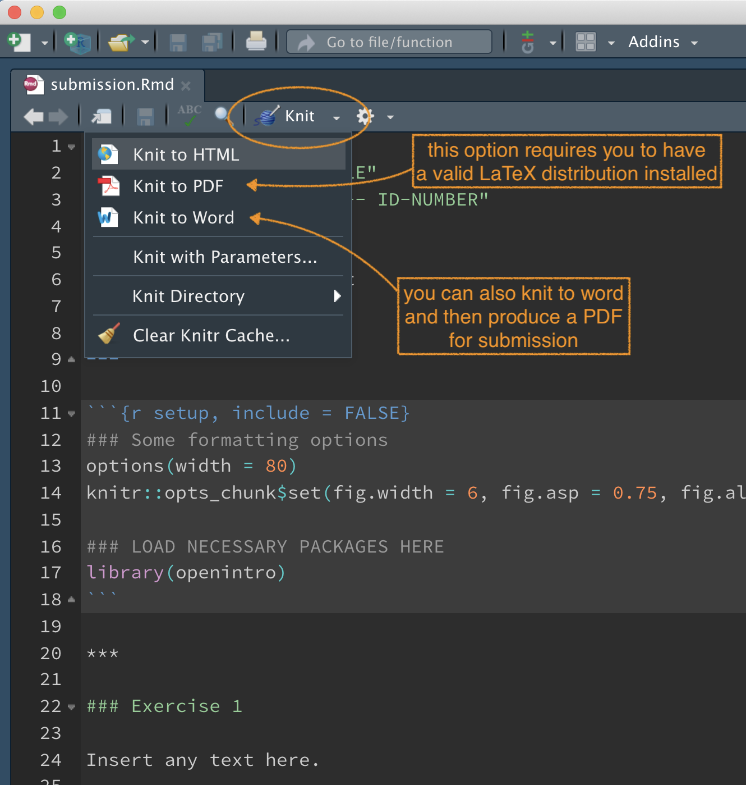

```{css, echo=FALSE}
body {
    counter-reset: li; /* initialize counter named li */
}

ol {
    margin-left:0; /* Remove the default left margin */
    padding-left:0; /* Remove the default left padding */
}
ol > li {
    position:relative; /* Create a positioning context */
    margin:0 0 10px 2em; /* Give each list item a left margin to make room for the numbers */
    padding:10px 80px; /* Add some spacing around the content */
    list-style:none; /* Disable the normal item numbering */
    border-top:2px solid #317EAC;
    background:rgba(49, 126, 172, 0.1);
}
ol > li:before {
    content:"Exercise " counter(li); /* Use the counter as content */
    counter-increment:li; /* Increment the counter by 1 */
    /* Position and style the number */
    position:absolute;
    top:-2px;
    left:-2em;
    -moz-box-sizing:border-box;
    -webkit-box-sizing:border-box;
    box-sizing:border-box;
    width:7em;
    /* Some space between the number and the content in browsers that support
       generated content but not positioning it (Camino 2 is one example) */
    margin-right:8px;
    padding:4px;
    border-top:2px solid #317EAC;
    color:#fff;
    background:#317EAC;
    font-weight:bold;
    font-family:"Helvetica Neue", Arial, sans-serif;
    text-align:center;
}
li ol,
li ul {margin-top:6px;}
ol ol li:last-child {margin-bottom:0;}

.oyo ul {
    list-style-type:decimal;
}

.oyo ul {
    list-style-type:decimal;
}


hr {
    border: 1px solid #357FAA;
}

div#boxedtext {
    background-color: rgba(86, 155, 189, 0.2);
    padding: 20px;
    margin-bottom: 20px;
    font-size: 10pt;
}

div#template {
    margin-top: 30px;
    margin-bottom: 30px;
    color: #808080;
    border:1px solid #808080;
    padding: 10px 10px;
    background-color: rgba(128, 128, 128, 0.2);
    border-radius: 5px;
}

div#license { 
    margin-top: 30px;
    margin-bottom: 30px;
    color: #4C721D;
    border:1px solid #4C721D;
    padding: 10px 10px;
    background-color: rgba(76, 114, 29, 0.2);
    border-radius: 5px;
}

/*------------ Fancy blocks --------------*/

.noteblock {
  padding: 1em 1em 1em 6em;
  margin-bottom: 20px;
  margin-top: 20px;
  border-left: 6px solid #042e6b;
  background: 1.5em center/2.5em no-repeat;
  background-image: url("images/info-circle.svg");
}

.tipblock {
  padding: 1em 1em 1em 6em;
  margin-bottom: 20px;
  margin-top: 20px;
  border-left: 6px solid #d5d5ce;
  background: 1.5em center/2em no-repeat;
  background-image: url("images/lightbulb.svg");
}

.warningblock {
  padding: 1em 1em 1em 6em;
  margin-bottom: 20px;
  margin-top: 20px;
  border-left: 6px solid #be4e00;
  background: 1.5em center/2.5em no-repeat;
  background-image: url("images/exclamation-triangle.svg");
}

.importantblock {
  padding: 1em 1em 1em 6em;
  margin-bottom: 20px;
  margin-top: 20px;
  border-left: 6px solid #c30000;
  background: 1.5em center/2.5em no-repeat;
  background-image: url("images/exclamation-circle.svg");
}

.exerciseblock {
  padding: 1em 1em 1em 6em;
  margin-bottom: 20px;
  margin-top: 20px;
  border-left: 6px solid #317EAC;
  background: rgba(49, 126, 172, 0.1) 1.5em center/2.5em no-repeat;
  background-image: url("images/flag.svg");
}
```

```{r setup, include = FALSE}
# packages
library(learnr)
library(openintro)
# devtools::install_github("rstudio-education/gradethis")
library(gradethis)
# devtools::install_github("rundel/learnrhash")
# library(learnrhash)

# tutorial options
tutorial_options(
  # code running in exercise times out after 30 seconds
  # if it is taking more than 30 s something is wrong 
  exercise.timelimit = 30,
  # use gradethis for checking
  exercise.checker = gradethis::grade_learnr
  )
options(width = 60)

# hide non-exercise code chunks
knitr::opts_chunk$set(echo = FALSE, comment = "", fig.align = "center", fig.width = 6, fig.asp = 0.75, out.width = "100%")
bob <- c("a", "b", "c")
arbuthnot
source("http://www.openintro.org/stat/data/cdc.R")
```

## RStudio and lab reports

The goal of this lab is to introduce you to R and RStudio, which you will be using throughout MA22004 both to learn the statistical concepts discussed in the course by analyzing real data to arrive at informed conclusions. To clarify which is which: R is the name of the programming language itself and RStudio is a piece of software that provides a convenient interface for working with R.

As the labs progress, you are encouraged to explore beyond what the labs dictate; a willingness to experiment will make you a much better programmer! Before we get to that stage, however, you need to build some basic fluency in R. First, we will explore the fundamental building blocks of R and RStudio: the RStudio interface, reading in data, and basic commands for working with data in R.

:::{.noteblock}
Both Labs 1 and 2 are covered in this tutorial. The Lab 1 report consists of answers to exercises 1-7. The Lab 2 report consists of answers to exercises 8-13. Further instructions on using the class template to produce a nice lab report containing both data analysis and text are in the next Section of this tutorial.
:::

### RStudio interface 

If you are already running this Lab tutorial then you have successfully installed and launched RStudio. Well done! You should see a window that looks more or less like the image shown below (I've added a few comments).

```{r r-interface-2020, fig.margin = TRUE, echo = FALSE, fig.width = 3, out.width = "100%", fig.cap="A fresh *RStudio* window. Please try to use R version **4.0.2 (2020-06-22) \"Taking Off Again\"**."}
knitr::include_graphics("images/r-interface-4-0-2.png")
```

The panel on the lower left is where the action happens. This panel is called the *console*. Every time you launch RStudio, it will have the same text at the top of the console telling you the version of R that you're running. Below that information is the *prompt*, indicated by the `>` symbol. As its name suggests, this prompt is really a request: a request for a command. Initially, interacting with R is all about typing commands and interpreting the output. These commands and their syntax have evolved over decades (literally) and now provide what many users feel is a fairly natural way to access data and organize, describe, and invoke statistical computations.

The panel in the upper right contains your *environment* as well as a history of the commands that you've previously entered.

The panel in the lower right contains tabs for browse the *files* in your project folder, access *help* files for R functions, install and manage R *packages*, and inspecting visualizations. By default, all data visualizations you make will appear directly below the code you used to create them. If you would rather your plots appear in the *plots* tab, you will need to change your global options.


### R Packages

R is an open-source programming language, meaning that users can contribute packages that make our lives easier, and we can use them for free. For this lab, and many others in the future, we will use the following:

<!-- -   The **tidyverse** "umbrella" package which houses a suite of many different R packages: for data wrangling and data visualization -->
-   The **openintro** R package: for data and custom functions with the OpenIntro resources
-   The **learnr** R package: for running these interactive lab tutorials
-   The **gradethis** R package: to serve you answers to interactive tutorial exercises

In the lower right-hand corner of the RStudio window you can find the *Packages* tab. Type the name of each of these packages (tidyverse, openintro, learnr) into the search box to see if they have been installed. If these packages do not appear when you type in their name, install them by copying and pasting or typing the following two lines of code into the console of your RStudio session. Be sure to press enter/return after each line of code.

```{r install-packages, message = FALSE, eval = FALSE, echo = TRUE}
install.packages("openintro")
install.packages("learnr")
install.packages("devtools") # to install `gradethis`
devtools::install_github("rstudio-education/gradethis")
```

After pressing enter/return, a stream of text will begin, communicating the process R is going through to install the package from the location you selected when you installed R. If you were not prompted to select a server for downloading packages when you installed R, RStudio may prompt you to select a server from which to download; any of them will work.

### Loading packages

You only need to *install* packages once, but you need to *load* them each time you relaunch RStudio. We load packages with the `library` function. Copy and paste or type the the following two lines in your console to load the openintro, learnr, and gradethis packages into your working environment. 

```{r load-packages, echo = TRUE, exercise = TRUE}
library(openintro)
library(learnr)
library(gradethis)
```

<!-- We are choosing to use the tidyverse package because it consists of a set of packages necessary for different aspects of working with data, anything from loading data to wrangling data to visualizing data to analyzing data. -->
<!-- Additionally, these packages share common philosophies and are designed to work together. You can find more about the packages in the tidyverse at [tidyverse.org](http://tidyverse.org/). -->

## Creating reproducible lab reports

As part of your grade for MA22004 you will need to submit lab reports. I have provided a template file that can be accessed through RStudio after you install and load the `ma22004` package. Access the template by selecting **File > New File > R Markdown**. You will then be greeted with a pop-up window. Select **From Template** from the left-hand pane and then select **MA22004 Lab Template**. A new **Untitled.Rmd** file will open. Feel free to change the name to something sensible and save it where you like; I suggest answering the exercise questions as you work through the lab.

[**Why use R Markdown for Lab Reports?**](https://youtu.be/lNWVQ2oxNho) <iframe width="560" height="315" src="https://www.youtube.com/embed/lNWVQ2oxNho" frameborder="0" allowfullscreen></iframe>

In a nutshell, using the template will allow you to easily combine data analysis ("R chunks") with text. You can then generate a PDF document for submission (but please retain the lab report markdown file for your records). 

Let's take a look at the anatomy of the template. At the top, there is a section that looks like this:

```markdown
---
title: "Lab NUMBER: TITLE"
author: "TEST STUDENT --- ID-NUMBER"
date: "`r Sys.Date()`"
output:
  word_document: default
  pdf_document: default
papersize: a4
---
```

You should update the lab title and author information (retaining the quotes) with your title, name, and student ID number. The date will automatically update, but of course you can change that if you want too.  

The next part of the tempalte contains an R chunk with some options that are loaded but will not be printed in the final report due ot the option `include = FALSE`. 

````markdown
`r ''` ```{r setup, include = FALSE}
### Some formatting options
options(width = 80)
knitr::opts_chunk$set(fig.width = 6, fig.asp = 0.75, fig.align = "center")

### LOAD NECESSARY PACKAGES HERE
library(openintro)
```
````

The R Markdown file knows that the gray box contains R code because it begins with three tick marks (\`\`\`), followed by {R `setup`}. The **name** of this code chunk is `setup`; each code chunk *must* have a different name. The command `library(openintro)` loads a package that contains data needed for your first lab assignment. You may add other commands to the setup chunk if you want --- but remember you won't see them in the final report. 


The rest of the template contains prompts for text and R code. To produce the final document you must "knit" the document into a Word Document or directly into a LaTeX PDF. You do this by selecting the the appropriate option from the "Knit" menu in RStudio. 

```{r r-knit-menu, fig.margin = TRUE, echo = FALSE, fig.width = 3, out.width = "75%", fig.cap="The Knit menu allows you to effortlessly produce a reproducible lab report combining both data analysis and text. If there is ever a question about you analysis, you can follow up by sending the source code!"}

```
 
Going forward you should refrain from typing your lab report code directly in the console, as this makes it very difficult to remember and reproduce the output you want to reference. Instead of typing our R code into the console, we encourage you to type any code you produce (final correct answer, or anything you're just trying out) in the R code chunk associated with each problem. Within the code chunk there are two ways to execute a line of R code: (1) place your cursor on the line on code and press `Ctrl-Enter` or `Cmd-Enter` (depending on your operating system), or (2) place your cursor on the line and press the "Run" button in the upper right hand corner of the R Markdown file.

## Nuts and bolts

### Entering input

At the most elementary level R works as a fancy calculator. R will evaluate whatever you type at the prompt
and return a result.  For example, try evaluating $5.7^{2}-2.57$. That is, fill in/replace the "blanks" and hit *Run Code* to evaluate your answer and/or *Submit Answer* (if the option is available) for instant feedback.

```{r ex-input-basic, exercise = TRUE}
___
```

```{r ex-input-basic-check}
grade_result(
  pass_if(~ identical(.result[1], 29.92)),
  fail_if(~ TRUE)
)
```

You can also use standard mathematical functions and operations.  

```{r ex-input-basicplus, exercise = TRUE}
sqrt(5) + 3 * sin(pi/2) + 1/4
```

A useful feature of R is its ability to create plots.  These typically appear in RStudio on the lower right hand panel in the Plots tab. Fill in the blank below to generate a scatter plot of **100** random numbers drawn from a Uniform distribution between 0.0 and 5.0:

```{r ex-input-plot, exercise = TRUE}
plot(runif(___, 0.0, 5.0))
```

### Working with arrays

The `R `language is based on objects which you can create, manipulate and delete.  The most basic object for holding data is called an array and is just an ordered list of things.  These are created using the function `c`. Often these things are numbers.  Fill in the blanks to create an array (suggested variable name `alvin`) containing just three numbers.

```{r ex-input-array, exercise = TRUE}
alvin <- c(___, ___, ___)
```

```{r ex-input-array-check}
grade_result(
  pass_if(~ (length(.result) == 3) & identical(class(.result), "numeric"), 
          "You entered a numeric array of length 3."),
  fail_if(~ !(length(.result) == 3), "Either too many or too few elements."),
  fail_if(~ !identical(class(.result), "numeric"), "Your array is not of type numeric.")
)
```

You can also see the object by typing its name. Try running the code below.

```{r ex-input-array-showbob, exercise = TRUE}
bob <- c("a", "b", "c")
bob
```

You can also output just one element of the array via indexing: `bob[index]`. Try retrieving the second element of `bob` by filling in the blanks. 

```{r ex-input-array-bob2, exercise = TRUE}
bob[___]
```

```{r ex-input-array-bob2-check}
grade_result(
  pass_if(~ identical(.result,"b"), 
          "Yes, the second element is \"b\".")
)
```

You can use R to generate sequences of numbers. See what the following commands do by running the code. Note that for long-ish output, the bracketed numbers at the left correspond to the index of the element that follows.

```{r ex-input-seq1, exercise = TRUE}
c(0:100)
```

```{r ex-input-seq2, exercise = TRUE}
seq(0, 100, by=5)
```

To remove objects from your environment use the `rm()` command.

## Handling data (Arbuthnot Data)

To illustrate the power of R at handling larger sets of data, lets examine some data on birth records collected by Dr. John Arbuthnot, an 18<sup>th</sup> century physician, writer, and mathematician.  He was interested in the ratio of newborn boys to newborn girls, so he gathered the baptism records for children born in London for every year from 1629 to 1710. 

### Arbuthnot Baptism Data

We can take a look at this dataset (which is made available by `library(openintro)`) by simply running the following code.

```{r view-data, exercise = TRUE}
arbuthnot
```

What you should see are three columns of numbers. Each row represents a different record that includes the year, the numbers of boys baptized, and the number of girls baptized.

If you load this dataset in the R console, note that there will also be row numbers in the first column that are not part of Arbuthnot's data. R adds them as part of its printout to help you make visual comparisons. You can think of them as the index that you see on the left side of a spreadsheet. R has stored Arbuthnot's data in a kind of spreadsheet or table called a **data frame**.

You can see the dimensions of this data frame by typing:

```{r dim-data, exercise = TRUE}
dim(arbuthnot)
```

This command should output `[1] 82 3`, indicating that there are 82 rows and 3 columns. You can see the names of these columns (or variables) by typing:

```{r names-data, exercise = TRUE}
names(arbuthnot)
```

You should see that the data frame contains the columns `year`,  `boys`, and `girls`. At this point, you might notice that many of the commands in R look a lot like functions from math class; that is, invoking R commands means supplying a function with some number of arguments. The `dim` and `names` commands, for example, each took a single argument, the name of a data frame. 

### Some exploration

Let's start to examine the data a little more closely. We can access the data in a single column of a data frame separately using a command like

```{r view-boys, eval = FALSE, echo = TRUE}
arbuthnot$boys
```

This command will only show the number of boys baptized each year.

```{r view-girls}
question(
  "What command would you use to extract just the counts of girls baptized?",
  answer("`arbuthnot$girls`", correct = TRUE),
  answer("`arbuthnot[girls]`", message = "Actually, `arbuthnot['girls']` would also work. But this answer is not that!"),
  answer("`arbuthnot = girls`"),
  answer("`arbuthnot.girls`"),
  allow_retry = TRUE,
  random_answer_order = TRUE
)
```

Notice that the way R has printed these data is different. When we looked at the complete data frame, we saw 82 rows, one on each line of the display. These data are no longer structured in a table with other variables, so they are displayed one right after another. Objects that print out in this way are called *vectors*; they represent a set of numbers. R has added numbers in [brackets] along the left side of the printout to indicate locations within the vector. For example, `5218` follows `[1]`, indicating that `5218` is the first entry in the vector. And if `[43]` starts a line, then that would mean the first number on that line would represent the 43<sup>rd</sup> entry in the vector.

R has some powerful functions for making graphics. Create a simple plot of the number of girls baptized per year with the `plot` command.

```{r plot-girls-vs-year, exercise = TRUE}
plot(x = arbuthnot$year, y = ___)
```


By default, R creates a scatterplot with each x,y pair indicated by an open circle. Notice that the command above again looks like a function, this time with two arguments separated by a comma.  The first argument in the plot function specifies the variable for the x-axis and the second for the y-axis. If we wanted to connect the data points with lines, we could supply a third argument, called `type` with the option `"l"` for **l**ine (not a number 1). Fill in the blanks below to produce a line plot. 

```{r plot-girls-vs-year-line, exercise = TRUE}
plot(x = arbuthnot$year, y = arbuthnot$girls, type = ___)
```

You might wonder how you are supposed to know that it was possible to add that third argument.  Thankfully, R documents all of its functions extensively. To read what a function does and learn the arguments that are available to you, just type in a question mark followed by the name of the function that you're interested in, e.g. `?plot`, in the console. Or you can use the search box in the Help tab in the lower right-hand pane in the RStudio window.

:::{.exerciseblock}
Using the **Arbuthnot Data Set**, generate a plot of year versus count of baptised girls that meets the following requirements. Add a title to the x-axis using the additional argument `xlab="year"`. Also add an appropriate y-axis label and plot title. You may use the "help" menu.

```{r answer-1, exercise = TRUE}
plot( ___ )
```
:::

:::{.exerciseblock}
Considering your plot in the exercise above, is there an apparent trend in the number of girls baptized over the years?  

```{r answer-2}
question_text(
  "Enter your solution as free text below.",
  answer("C0rrect", correct = TRUE),
  incorrect = "Okay! [even if this button is red]",
  try_again_button = "Modify your answer",
  allow_retry = TRUE
)
```
:::

### Some further exploration

Now, suppose we want to plot the total number of baptisms.  To compute this, we could use the fact that R is really just a big calculator. We can type in mathematical expressions like

```{r calc-total-bapt-numbers, echo = TRUE, eval = FALSE}
5218 + 4683
```

to see the total number of baptisms in 1629. We could repeat this once for each year, but there is a faster way. Adding the corresponding vectors for baptisms for boys and girls will result in a vector of total baptisms. Try it now.

```{r calc-total-bapt-vars, exercise = TRUE}
arbuthnot$boys + ___
```

What you will see are 82 numbers, each one representing the sum we're after. Take a look at a few of them and verify that they are right. Therefore, make a plot of the total number of baptisms per year.

```{r plot-total-vs-year, exercise = TRUE}
plot(arbuthnot$year, ___, type = "l")
```

This time, note that we left out the name of the first argument.  We can do this because the help file shows that the default for `plot` is for the first argument to be the x-variable and the second argument to be the y-variable.

Compute the proportion of newborns that are boys for all years.

```{r calc-prop-boys-vars, exercise = TRUE}
___ / (___ + ___)
```

```{r calc-prop-boys-vars-check}
grade_result(
  pass_if(~ identical(signif(as.numeric(.result[42]), digits = 4), signif(0.5232975, digits=4)), "At least the 42nd element is correct to four decimal places.")
)
```

Note that with R as with your calculator, you need to be conscious of the order of operations. Here, we want to divide the number of boys by the total number of newborns, so we have to use parentheses.  Without them, R will first do the division, then the addition, giving you something that is not a proportion.

:::{.exerciseblock}
Using the **Arbuthnot Data Set**, make a plot of the proportion of boys over time. Comment on the qualitative nature of the plot that you made. 

```{r answer-3a, exercise = TRUE}
plot(___)
```

```{r answer-3b}
question_text(
  "Enter your solution as free text below.",
  answer("C0rrect", correct = TRUE),
  incorrect = "Okay! [even if this button is red]",
  try_again_button = "Modify your answer",
  allow_retry = TRUE
)
```
:::

Finally, in addition to simple mathematical operators like subtraction and division, you can ask R to make comparisons like greater than, `>`, less than, `<`, and equality, `==`. Use one of the preceding logical operators to determine whether boys outnumber girls in each year.

```{r boys-more-than-girls, exercise = TRUE}
arbuthnot$boys ___ arbuthnot$girls
```

```{r boys-more-than-girls-check}
grade_result(
  pass_if(~ (sum(.result) == 82), "That appears correct. Boys are more commom, eh?"),
  fail_if(~ !(sum(.result) == 82), "Tip: check the data table by entering `arbuthnot`...")
)
```

This command returns 82 values of either `TRUE` if that year had more boys than girls, or `FALSE` if that year did not (the answer may surprise you). This output shows a different kind of data than we have considered so far. In the `arbuthnot` data frame our values are numerical (the year, the number of boys and girls). Here, we've asked R to create *logical* data, data where the values are either `TRUE` or `FALSE`. In general, data analysis will involve many different kinds of data types, and one reason for using R is that it is able to represent and compute with many of them.

## Data analysis (CDC Health Data)

Some define Statistics as the field that focuses on turning information into knowledge.  The first step in that process is to summarize and describe the raw information - the data. In this section, you will gain insight into public health by generating simple graphical and numerical summaries of a data set collected by the Centers for Disease Control and Prevention (CDC). As this is a large data set, along the way you'll also learn the indispensable skills of data processing and subsetting.

### Getting started

The Behavioral Risk Factor Surveillance System (BRFSS) is an annual telephone survey of 350,000 people in the United States. As its name implies, the BRFSS is designed to identify risk factors in the adult population and report emerging health trends. For example, respondents are asked about their diet and weekly physical activity, their HIV/AIDS status, possible tobacco use, and even their level of healthcare coverage. The BRFSS Web site ([http://www.cdc.gov/brfss](http://www.cdc.gov/brfss)) contains a complete description of the survey, including the research questions that motivate the study and many interesting results derived from the data.

We will focus on a random sample of 20,000 people from the BRFSS survey conducted in 2000. While there are over 200  variables in this data set, we will work with a small subset. We begin by loading the data set of 20,000 observations into the R workspace. After launching RStudio, enter the following command. We will refer to this data set as the The **CDC Health Data** or to the data frame as `cdc`. Note this tutorial has already loaded `cdc` in the background; you will need to add the line below to the setup chunk of your lab report.

```{r load-cdc-data, eval = FALSE, echo = TRUE}
source("http://www.openintro.org/stat/data/cdc.R")
```

The data set `cdc` that shows up in your workspace is a *data matrix*, with each row representing a *case* and each column representing a *variable*.  R calls this data format a *data frame*, which is a term that will be used throughout the labs.

To view the names of the variables, one uses the `names` function.

```{r names, exercise = TRUE}
names(___)
```

This returns the names `genhlth`, `exerany`, `hlthplan`, `smoke100`, `height`, `weight`, `wtdesire`, `age`, and `gender`. Each one of these variables corresponds to a question that was asked in the survey. For example, for `genhlth`, respondents were asked to evaluate their general health, responding either excellent, very good, good, fair or poor. The `exerany` variable indicates whether the respondent exercised in the past month (1) or did not (0). Likewise, `hlthplan` indicates whether the respondent had some form of health coverage (1) or did not (0). The `smoke100` variable indicates whether the respondent had smoked at least 100 cigarettes in her lifetime. The other variables record the respondent's `height` in inches, `weight` in pounds as well as their desired weight, `wtdesire`, `age` in years, and `gender`.

We can have a look at the first few entries (rows) of our data with the `head` function.

```{r head, exercise = TRUE}
___(cdc)
```

Similarly we can look at the last few using the `tail` function.

```{r tail, exercise = TRUE}
___(cdc)
```

You could also look at *all* of the data frame at once by typing its name into the console, but that might be unwise here.  We know `cdc` has 20,000 rows, so viewing the entire data set would mean flooding your screen.  It's better to take small peeks at the data with `head`, `tail` or the subsetting techniques that you'll learn in a moment.

### Summaries and tables

The BRFSS questionnaire is a massive trove of information.  A good first step in any analysis is to distill all of that information into a few summary statistics and graphics.  As a simple example, the function `summary` returns a numerical summary: minimum, first quartile, median, mean, second quartile, and maximum. 

Try producing a summary for the `weight` variable.

```{r summary-weight, exercise = TRUE}
summary(___$___)
```

If you wanted to compute the interquartile range for the respondents' weight, you would look at the output from the summary command above and then enter:

```{r weight-range-arith, eval = FALSE, echo = TRUE}
190 - 140
```

R also has built-in functions to compute summary statistics one by one. For instance, the mean, median, and variance of `weight` can be calculated using the obvious functions.

```{r weight-mean-var-median, eval = FALSE, echo = TRUE}
mean(cdc$weight) 
var(cdc$weight)
median(cdc$weight)
```

While it makes sense to describe a quantitative variable like `weight` in terms of these statistics, what about categorical data?  We would instead consider the sample frequency or relative frequency distribution.  The function `table` does this for you by counting the number of times each kind of response was given. 

Use the `table` function to see the number of people who have smoked 100 cigarettes in their lifetime (`smoke100`), type

```{r table-smoke, exercise = TRUE}
table(___)
```

The relative frequency distribution can be found by by typing

```{r table-smoke-prop, echo = TRUE}
table(cdc$smoke100)/20000
```

Notice how R automatically divides all entries in the table by 20,000 in the command above. This is similar to something we observed in the first part of this lab; when we multiplied or divided a vector with a number, R applied that action acrossentries in the vectors. As we see above, this also works for tables (without modifying the table headings). 

Next, make a bar plot of the entries in the table by putting the table inside the `barplot` command.

```{r table-smoke-barplot, exercise = TRUE}
barplot(table(___))
```

Notice what we've done here! We've computed the table of `cdc$smoke100` and then immediately applied the graphical function, `barplot`. This is an important idea: R commands can be nested. You could also break this into two steps by typing the following:

```{r table-smoke-barplot-twosteps, eval = FALSE, echo = TRUE}
smoke <- table(cdc$smoke100)
barplot(smoke)
```

Here, we've made a new object, a table, called `smoke` and then used it in as the input for `barplot`. The special symbol `<-` performs an **assignment**, taking the output of one line of code and saving it into an object in your workspace. This is another important idea that we'll return to later.

:::{.exerciseblock}
Using the **CDC Data**, create a numerical summary for `height` and `age`, and compute the interquartile range for each. Compute the relative frequency distribution for `gender` and `exerany`. How many males are in the sample? What proportion of the sample reports being in excellent health? 

```{r answer-4, exercise = TRUE}
___
```
:::

The `table` command can be used to tabulate any number of variables that you provide. For example, to examine which participants have smoked across each gender, we could use the following.

```{r table-smoke-gender, eval = FALSE, echo = TRUE}
table(cdc$gender,cdc$smoke100)
```

Here, we see column labels of 0 and 1. Recall that 1 indicates a respondent has smoked at least 100 cigarettes. The rows refer to gender. Create a mosaic plot of this table (`gender` vs `smoke100`), by passing a table to the `mosiacplot` function.

```{r mosaic-smoke-gender, exercise = TRUE}
mosaicplot(___)
```

:::{.exerciseblock}
Generate a mosaic plot of `gender` vs `smoke100` from the **CDC Health Data**. What does the mosaic plot of  reveal about smoking habits and gender? 

```{r answer-5a, exercise = TRUE}

```

```{r answer-5b}
question_text(
  "Enter your solution as free text below.",
  answer("C0rrect", correct = TRUE),
  incorrect = "Okay! [even if this button is red]",
  try_again_button = "Modify your answer",
  allow_retry = TRUE
)
```
:::

### Interlude: How R thinks about data

We mentioned that R stores data in data frames, which you might think of as a type of spreadsheet. Each row is a different observation (a different respondent) and each column is a different variable (the first is `genhlth`, the second `exerany` and so on). Use the `dim` function to view the size of the `cdc` data frame; this will return the number of rows and columns. (In RStudio, you can see this information by simply looking next to the object name in the *Environment* pane in the upper right-hand corner).

```{r dim, exercise = TRUE}
___(___)
```

Now, if we want to access a subset of the full data frame, we can use row-and-column notation. For example, to see the sixth variable of the 567<sup>th</sup> respondent, use the format

```{r cdc-row567-column6, eval = FALSE, echo = TRUE}
cdc[567,6]
```

which means we want the element of our data set that is in the 567<sup>th</sup> row (meaning the 567<sup>th</sup> person or observation) and the 6<sup>th</sup> column (in this case, `weight`). We know that `weight` is the 6<sup>th</sup> variable because it is the 6<sup>th</sup> entry in the list of variable names.

```{r names-again, eval = TRUE, echo = TRUE}
names(cdc)
```

To see the weights for the first 10 respondents we can type

```{r first-10-rows-sixth-column, eval = FALSE, echo = TRUE}
cdc[1:10,6]
```

In this expression, we have asked just for rows in the range 1 through 10.  R uses the `:` to create a range of values, so 1:10 expands to 1, 2, 3, 4, 5, 6, 7, 8, 9, 10. 

Finally, if we want all of the data for the first 10 respondents, type

```{r first-10-rows, eval = FALSE, echo = TRUE}
cdc[1:10,]
```

By leaving out an index or a range (we didn't type anything between the comma and the square bracket), we get all the columns. When starting out in R, this is a bit counterintuitive. As a rule, we omit the column number to see all columns in a data frame. Similarly, if we leave out an index or range for the rows, we would access all the observations, not just the 567<sup>th</sup>, or rows 1 through 10. Display the weights of the second batch of 100 respondents.

```{r 6th-column, exercise = TRUE}
cdc[___, ___]
```

```{r 6th-column-check}
grade_result(
  pass_if(~ .result[3] ==110),
  fail_if(~ length(.result) != 100, "This vector doesn't seem to be the correct size."),
  fail_if(~ .result[1] != 118, "This vector doesn't seem to start at the correct index.")
)
```

Recall that column 6 represents respondents' weight, so the command above reported all of the weights in the data set. An alternative method to access the weight data is by referring to the name.  Previously, we typed `names(cdc)` to see all the variables contained in the cdc data set. We can use any of the variable names to select items in our data set. 

```{r weight, eval = FALSE, echo = TRUE}
cdc$weight
```

The dollar-sign tells R to look in data frame `cdc` for the column called `weight`.  Since that's a single vector, we can subset it with just a single index inside square brackets.  We see the weight for the 567<sup>th</sup> respondent by typing

```{r weight-567, eval = FALSE, echo = TRUE}
cdc$weight[567]
```

Write a code to retrieve the weights of the first 10 respondents using the dollar-sign notation. 

```{r weight-first10, exercise = TRUE}
___
```

The command above returns the same result as the `cdc[1:10,6]` command. Both row-and-column notation and dollar-sign notation are widely used, which one you choose to use depends on your personal preference.

### A little more on subsetting

It's often useful to extract all individuals (cases) in a data set that have specific characteristics. We accomplish this through *conditioning* commands. First, consider expressions like

```{r true-male, eval = FALSE, echo = TRUE}
cdc$gender == "m"
```

or

```{r true-over30, eval = FALSE, echo = TRUE}
cdc$age > 30
```

These commands produce a series of `TRUE` and `FALSE`  values. There is one value for each respondent, where `TRUE` indicates that the person was male (via the first command) or older than 30 (second command).

Suppose we want to extract just the data for the men in the sample, or just for those over 30. We can use the R function `subset` to do that for us. For example, the command

```{r males, exercise = TRUE}
mdata <- subset(cdc, gender == "m")
```

will create a new data set called `mdata` that contains only the men from the `cdc` data set. This new data set contains all the same variables but just under half the rows. The important thing is that we can carve up the data based on values of one or more variables.

As an aside, you can use several of these conditions together with `&` and `|`. The `&` is read "and" so that `|` character is read "or". 

Create a subset of the health data of men over thirty. 

```{r males-and-over30, exercise = TRUE}
m_and_over30 <- subset(___)
m_and_over30 
```

```{r males-and-over30-check}
grade_result(
  pass_if(~ all((dim(.result) == c(7244, 9)) & (.result['age'] > 30) & (.result['gender'] == 'm'))),
  fail_if(~ !all(.result['age'] > 30), "The ages are not above 30."),
  fail_if(~ !all(.result['gender'] == "m"), "Not all of the respondents are male."),
  fail_if(~ !all(dim(.result) == c(7244, 9)), "This vector doesn't seem to be the correct size."),
)
```

Create a subset of the health data of mean or people over thirty. 

```{r males-or-over30, exercise = TRUE}
m_or_over30 <- subset(cdc, gender == "m" | age > 30)
m_or_over30
```

```{r males-or-over30-check}
grade_result(
  pass_if(~ all((dim(.result) == c(17591, 9)) & ((.result['age'] > 30) | (.result['gender'] == 'm')))),
  fail_if(~ !all(.result['age'] > 30), "The ages are not above 30."),
  fail_if(~ all(.result['gender'] == "m"), "All of the respondents are male. You should be females over thrity too."),
  fail_if(~ !all(dim(.result) == c(17591, 9)), "This vector doesn't seem to be the correct size.")
)
```

In principle, you may use as many "and" and "or" clauses as you like when forming a subset.

:::{.exerciseblock}
Using the **CDC Health Data**, create a new object called `under23_and_smoke` that contains all observations of respondents under the age of 23 that have smoked 100 cigarettes in their lifetime. Write the command you used to create the new object as the answer to this exercise. **[1 mark]**

```{r answer-6, exercise = TRUE}
under23_and_smoke <- ___
under23_and_smoke
```
:::

### Quantitative data

With our subsetting tools in hand, we'll now return to the task of the day: making basic summaries of the **CDC Health Data**.  We've already looked at categorical data such as `smoke` and `gender` so now let's turn our attention to quantitative data.  Two common ways to visualize quantitative data are with box plots and histograms.  We can construct a box plot for a single variable with the following command.

```{r boxplot-height, exercise = TRUE}
boxplot(cdc$height)
```

You can compare the locations of the components of the box by examining the summary statistics.

```{r summary-height, exercise = TRUE}
summary(cdc$height)
```

Confirm that the median and upper and lower quartiles reported in the numerical summary match those in the graph. The purpose of a boxplot is to provide a thumbnail sketch of a variable for the purpose of comparing across several categories. For example, we can compare the heights of men and women using the `~` notation. 

```{r boxplot-height-gender, exercise = TRUE}
boxplot(cdc$height ~ cdc$gender)
```

The `~` character can be read *versus* or *as a function of*. So we're asking R to give us a box plots of heights where the groups are defined by gender. 

Next let's consider a new variable that doesn't show up directly in this data set: Body Mass Index (BMI) [[W]](http://en.wikipedia.org/wiki/Body_mass_index). BMI is a weight to height ratio and can be calculated as:

\[ BMI = \frac{weight~(lb)}{height~(in)^2} * 703 \]

The factor of 703 is the approximate conversion to change units from metric (meters and kilograms) to imperial (inches and pounds).

Create a new object called `bmi` and then create box plots of `bmi` versus `genhlth`.

```{r boxplot-bmi, exercise = TRUE}
bmi <- (___ / ___) * 703
boxplot(___ ~ ___)
```

Notice that the first line above is just some arithmetic, but it's applied to all 20,000 numbers in the `cdc` data set. That is, for each of the 20,000 participants, we take their weight, divide by their height-squared and then multiply by 703. The result is 20,000 BMI values, one for each respondent. This is one reason why we like R: it lets us perform computations like this using very simple expressions.

:::{.exerciseblock}
Using the **CDC Health Data**, create a box plot of `bmi` versus `genhlth`. What does this box plot show? Pick another categorical variable from the data set and see how it relates to BMI. List the variable you chose, why you might think it would have a relationship to BMI,  and indicate what the figure seems to suggest. 

```{r answer-7a, exercise = TRUE}
bmi <- (___ / ___) * 703
boxplot(___ ~ ___)
```

```{r answer-7b}
question_text(
  "Enter your solution as free text below.",
  answer("C0rrect", correct = TRUE),
  incorrect = "Okay! [even if this button is red]",
  try_again_button = "Modify your answer",
  allow_retry = TRUE
)
```    
:::

Finally, let's make some histograms using the command `hist`. Create a histogram for the age of our respondents.

```{r hist-age, exercise = TRUE}
hist(___)
```

Histograms are generally a very good way to see the shape of a single distribution, but that shape can change depending on how the data is split between the different bins.  You can control the number of bins by adding an argument to the command. Experiment with changing the number of breaks (e.g., make the number 50 something smaller and then something bigger). 

```{r hist-bmi, exercise = TRUE}
hist(bmi, breaks = 50)
```

How do these two histograms compare?

At this point, we've done a good first pass at analyzing the information in the BRFSS questionnaire.  We've found an interesting association between smoking and gender, and we can say something about the relationship between people's assessment of their general health and their own BMI.  We've also picked up essential computing tools -- summary statistics, subsetting, and plots -- that will serve us well throughout this course.

## Summary (Exercises 1-13)

The **Arbuthnot Data Set** is made available by loading the openintro package (`library(openintro)`). The **CDC Health Data** is made available by `source("http://www.openintro.org/stat/data/cdc.R")`. 

1.  Using the **Arbuthnot Data Set**, generate a plot of year versus count of baptized girls that meets the following requirements. Add a title to the x-axis using the additional argument `xlab="year"`. Also add an appropriate y-axis label and plot title. You may use the "help" menu. **[4 marks]**

2.  Considering your plot in Exercise 1, is there an apparent trend in the number of girls baptized over the years?  **[2 mark]**

3.  Using the **Arbuthnot Data Set**, make a plot of the proportion of boys over time. Comment on the qualitative nature of the plot. **[2 marks]**

4.  Using the **CDC Health Data**, create a numerical summary for `height` and `age`, and compute the interquartile range for each. Compute the relative frequency distribution for `gender` and `exerany`. How many males are in the sample? What proportion of the sample reports being in excellent health? **[5 marks]**

5.  Generate a mosaic plot of `gender` vs `smoke100` from the **CDC Health Data**. What does the mosaic plot of  reveal about smoking habits and gender? **[2 marks]**

6.  Using the **CDC Health Data**, create a new object called `under23_and_smoke` that contains all observations of respondents under the age of 23 that have smoked 100 cigarettes in their lifetime. Write the command you used to create the new object as the answer to this exercise. **[1 mark]**

7.  Using the **CDC Health Data**, create a box plot of `bmi` versus `genhlth`. What does this box plot show? Pick another categorical variable from the data set and see how it relates to BMI. List the variable you chose, why you might think it would have a relationship to BMI,  and indicate what the figure seems to suggest. **[4 marks]**

8.  Using the **CDC Health Data**, make a scatter plot (using the plot command) of weight versus desired weight. Describe the relationship between these two variables. **[3 marks]**

9.  Using the **CDC Health Data**, consider a new variable: the difference between desired weight (`wtdesire`) and current weight (`weight`). Create this new variable by subtracting the two columns in the data frame and assigning them to a new object called `wdiff`. Write the command you used to create the new object as the answer to this exercise. **[1 mark]**

10.  What type of data is `wdiff` in Exercise 9? If an observation `wdiff` is 0, what does this mean about the person's weight and desired weight? What if `wdiff` is positive or negative? **[2 marks]**

11.  By using appropriate numerical summaries and plots, describe the distribution of `wdiff`, created in Exercise 9, in terms of its center, shape, and spread, including any plots you use. What does this tell us about how people feel about their current weight? **[4 marks]**

12.  Using numerical summaries and a side-by-side box plot, determine if men tend to view their weight differently 
than women.  **[4 marks]**

13.  Find the mean and standard deviation of `weight` in `cdc` and determine what proportion of the weights are within one standard deviation of the mean. Give a box plot for the values of `wdiff` for the subset of individuals whose weight is  within one standard deviation of the mean weight. How does the distribution of `wdiff` vary for this subset? **[6 marks]**


To submit your completed laboratory assignments, upload to Gradescope (only) the answers to the exercises (1-13) above on this summary page; some of the questions are repeated in-line in the tutorial to provide some context. Both Labs 1 and 2 are covered in this tutorial. The Lab 1 report consists of answers to exercises 1-7. The Lab 2 report consists of answers to exercises 8-13. Further instructions on using the class template to produce a nice lab report containing both data analysis and text are in the first Section "RStudio and lab reports" of this tutorial.

------------------------------------------------------------------------

<a rel="license" href="http://creativecommons.org/licenses/by-sa/4.0/">{style="border-width:0"}</a><br />This work is licensed under a <a rel="license" href="http://creativecommons.org/licenses/by-sa/4.0/">Creative Commons Attribution-ShareAlike 4.0 International License</a>.

This work is derivative of OpenIntro Labs and was modified by Eric Hall (2020.09.17). The original labs were adapted for OpenIntro by Andrew Bray and Mine Çetinkaya-Rundel from labs written by Mark Hansen of UCLA Statistics.

