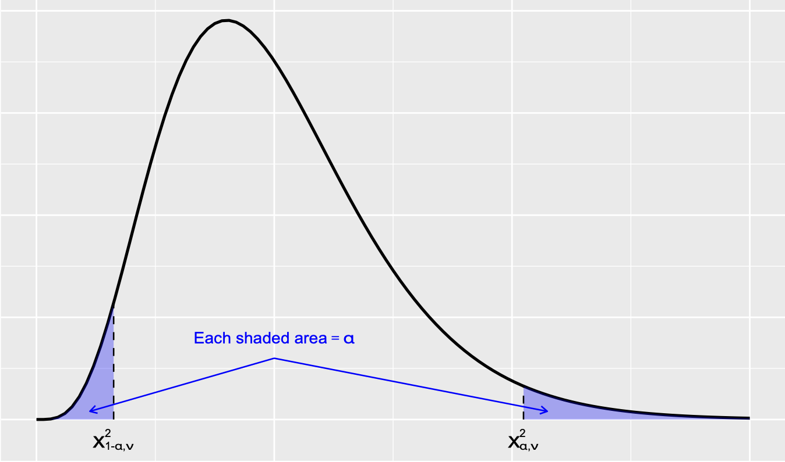

\DeclareMathOperator{\Var}{Var}
\DeclareMathOperator{\E}{\mathbf{E}}
\DeclareMathOperator{\Cov}{Cov}
\DeclareMathOperator{\corr}{corr}
\newcommand{\se}{\mathsf{se}}
\DeclareMathOperator{\sd}{sd}

```{r setup, include=FALSE}
knitr::opts_chunk$set(echo = FALSE, comment = "")
```

## Announcements

### Reminders 

- It is week 3! You should have read §3.1 of the notes on **Perusall**.
- Feedback for Lab 1 is posted.

### Upcoming
- Lab 2 due **TODAY** at **17:00**: upload to **Gradescope**. 
Late submissions will be accepted until Sat 24/10 at 13:00.
- Worksheet #3 (Estimating Proportions) on **Blackboard**: do before next workshop.
- Investigation #2 on **Perusall**: do before next workshop. 
- Reading assignment remainder §3 on **Perusall**: do before next seminar. 

## Estimating means

### Confidence intervals 

\[\text{point estimate} \mu  \pm (\text{critical value}) \cdot (\text{precision of point estimate})\]

### Hypothesis tests

A hypothesis test asks if the available data provides sufficient evidence to reject a null hypothesis $H_0$ which is assume to be true. 

Tests on equality of mean $\mu$, i.e., $H_0 : \mu = \mu_0$ against 

- $H_a : \mu \neq \mu_0$
- $H_a : \mu \geq \mu_0$
- $H_a : \mu \leq \mu_0$

<div class="notes">
- If the observations disagree with $H_0$, then we reject the null hypothesis. 
- If the sample evidence does not strongly contradict $H_0$, then we continue to believe $H_0$. 
- $\mu_0$ is the **null value** that separate the 
</div>

## Estimating means: consider the population

We consider inferences for three different parent populations. 

1. Normal population with known $\sigma$
2. Any population with unknown $\sigma$, when $m$ large
3. Normal population with unknown $\sigma$, $m$ may be small

What changes? What stays the same?

## Estimating means: $100(1-\alpha)\%$ CIs

1. Normal population with known $\sigma$:
\[\overline{x} \pm z_{\alpha/2} \frac{\sigma}{\sqrt{m}}\]
2. Any population with unknown $\sigma$, when $m$ large
\[\overline{x} \pm z_{\alpha/2} \frac{s}{\sqrt{m}}\]
3. Normal population with unknown $\sigma$, $m$ may be small
\[\overline{x} \pm t_{\alpha/2, m-1} \frac{s}{\sqrt{m}}\]


## Estimating means: hypothesis tests

1. Normal population with known $\sigma$:
\[Z = \frac{\overline{X} - \mu_0}{\sigma / \sqrt{m}} \sim \mathsf{N}(0,1)\]
2. Any population with unknown $\sigma$, when $m$ large
\[Z = \frac{\overline{X} - \mu_0}{S / \sqrt{m}} \sim \mathsf{N}(0,1)\]
3. Normal population with unknown $\sigma$, $m$ may be small
\[T = \frac{\overline{X} - \mu_0}{S / \sqrt{m}} \sim \mathsf{t}(m-1)\]

<div class="notes">
- Once we have sample data we make point estimate!
</div>

## Recall: critical values

Critical values are quantiles of the  reference distribution. 

```{r network, echo=FALSE, fig.cap="", out.width = '50%'}

```

- Using R: `qnorm`, `qt`, `qchisq`
- Using table

<div class="notes">
- $\chi^2$ distribution is not symmetric! $\mathsf{N}$ and $\mathsf{t}$ are symmetric.
- For $\alpha/2 = 0.025$, $z_{\alpha/2} = 1.96$.
</div>

## The skinny on hypothesis testing

1. Compute the value of an appropriate test statistic.
2. Determine the $P$-value, probability calculated assuming the null is true of observing a test statistic value at least as contradictory to $H_0$ as what was obtained from evidence.
3. For given $\alpha$, reject $H_0$ if $P \leq \alpha$. If evidence is not strong enough, we fail to reject $H_0$. 

## Example (hypothesis testing 1/n)

### Freshman 15 [Devore eg 8.2]

> *A common belief among the lay public is that body weight increases after entry into [university], and the phrase "freshman 15" has been coined to describe the 15 pounds that students presumably gain over their freshman [(i.e. first)] year.*

## Example (2/n)

Let $\mu$ denote the true average weight gain of women over the course of their first year at university. The foregoing quote suggests that we should test the hypotheses $H_0: \mu = 15$ versus $H_a : \mu \neq 15$. 

Suppose that a random sample of $m$ such individuals is selected and the weight gain of each one is determined, resulting in a sample mean weight gain $\overline{x}$ and a sample standard deviation $s$. 

<div class="notes">
- Before data is obtained, the sample mean weight gain is a random variable $X$ and the sample standard deviation is also a random variable $S$!
</div>

## Example (3/n)

<div class="notes">
- \[Z = \frac{\overline{X} - \mu}{\sigma/ \sqrt{m}}\]
- Assuming $H_0$ is true: \[Z = \frac{\overline{X} - 15}{\sigma/ \sqrt{m}}\]
- But don't know $\sigma$:
\[Z = \frac{\overline{X} - 15}{S/ \sqrt{m}} \sim \mathsf{N}(0,1)\]
</div>

## Example (4/n)

Suppose $\overline{x} = 13.7$ and plugging in values for $s$ and $\sqrt{n}$ yields $z = -2.8$. 

Which values of the test statistic are at least as contradictory to $H_0$ as $-2.80$ itself?

<div class="notes">
- E.g., $m = 40$ and $s = 2.936401$
- Possible values: 13.5, 13.0, any value smaller than 13.7 is more contradictory to $H_0$ than 13.7
- 16.3 is just as contradictory to $H_0$ as is 13.7; both fall the same distance from the null value 15
- Just as values of $\overline{x}$ that are at most 13.7 correspond to $z\leq -2.8$, values of $\overline{x}$ that are at least 16.3 correspond to $z \geq 2$
</div>

## Example (5/n)

$P( Z \leq -2.80 \quad \text{or}\quad  Z \geq 2.80 \quad \text{assuming } H_0 \text{ true})$

<div class="notes">
$\approx 2 \cdot$ (area under the $z$ curve ot the right of 2.80)
$= 2[1 - \Phi(2.80)] = 2[1 - 0.9974] = 0.0052

- If the null hypothesis is in fact true, only about one half of one percent of all samples would result in a test statistic value at least as contradictory to the null hypothesis as is our value. Clearly -2.80 is among the possible test statistic values that are most contradictory to $H_0$. 
- The evidence suggest to reject $H_0$.
</div>

## Example (6/n)

The article *Freshman 15: Fact or Fiction* (Obesity, 2006: 1438– 1443), for $m = 137$ students, the $\overline{x} = 2.42$ lb with $s =  5.72$ lb. 

This gives \[z = (2.42 - 15)/(5.72 /\sqrt{137}) = -25.7\,.\]

The probability of observing a value at least this extreme in either direction is essentially zero! 

The data very strongly contradicts the null hypothesis, and there is substantial evidence that true average weight gain is much closer to $0$ than to $15$.

<div class="notes">
- Note this implies some students lost weight!
</div>


## Summary

Today we discussed CI and hypothesis tests for population means for three cases:

- normal populations with known $\sigma$
- population with unknown $\sigma$ when sample size is large
- normal population with unknown $\sigma$ when sample size is small
