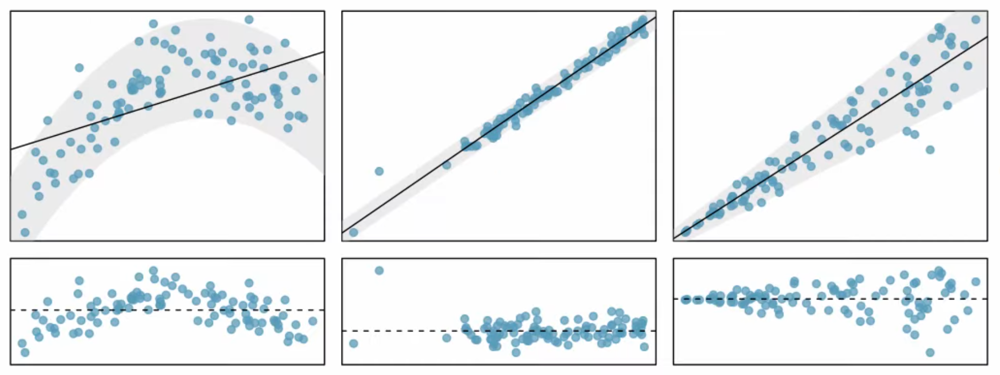

\DeclareMathOperator{\Var}{Var}
\DeclareMathOperator{\E}{\mathbf{E}}
\DeclareMathOperator{\Cov}{Cov}
\DeclareMathOperator{\corr}{corr}
\newcommand{\se}{\mathsf{se}}
\DeclareMathOperator{\sd}{sd}

```{r setup, include=FALSE}
knitr::opts_chunk$set(echo = FALSE, comment = "")
library(tidyverse)
library(latex2exp)
library(knitr)
library(kableExtra)
library(janitor)
library(cowplot)

library(palmerpenguins)
data("penguins")

gentoo <- penguins %>% filter(species == "Gentoo") %>% na.exclude
adelie <- penguins %>% filter(species == "Adelie") %>% na.exclude
chinstrap <- penguins %>% filter(species == "Chinstrap") %>% na.exclude

theme_ur <- theme(legend.justification = c(1,1), legend.position = c(1,1), legend.box.margin = margin(c(4, 4, 4, 4), unit = "pt"))
theme_lr <- theme(legend.justification = c(1,0), legend.position = c(1,0), legend.box.margin = margin(c(4, 4, 4, 4), unit = "pt"))
options(width = 90, knitr.kable.NA = '', "kableExtra.html.bsTable" = T)
lsz <- 1.0
tsz <- 4
```

## Announcements 

### Reminders 

- It is week 8! You should have read the remainder of §6 of the notes on **Perusall**.
- Class test 2 was yesterday.


## Linear Regression (what is it?)

- Assumes relationship between two variables $X$ and $Y$ can be modeled by a straight line
- Perfect linear relationship: we would know the exact value of $Y$ just by knowing the exact value of $X$

\[y = \beta_0 + \beta_1 x\]

<div class="notes">
- $X$ is explanatory or predictor; $Y$ is response
- ESTIMATE $\beta_0$ intercept and $\beta_1$ slope from DATA
- Point estimates $\widehat{\beta}_0$ and $\widehat{\beta}_1$
</div>


## Palmer penguins (Gentoo)

```{r gentoo, warning=FALSE}
ggplot(gentoo, aes(x = flipper_length_mm, y = body_mass_g)) + geom_point(aes(color = species), alpha = 0.8, size=3) + 
   xlab("Flipper length (mm)") + ylab("Body mass (g)")
```

<div class="notes">
- Measurement data (119 obs) from the Palmer Long-Term Ecological Research (LTER) in Antarctica
- Gentoo penguins that have above average flipper length tend to also have above average body mass
- Could be helpful to explain relationship with a straight line: predict body mass from flipper length
</div>

## Fitting a line by eye

```{r gentoo-fit-by-eye, warning=FALSE}
ggplot(gentoo, aes(x = flipper_length_mm, y = body_mass_g)) + geom_point(aes(color = species), alpha = 0.8, size=3) + 
   xlab("Flipper length (mm)") + ylab("Body mass (g)") + geom_abline(intercept = -7200, slope = 56, size=1, )
```

<div class="notes">
- slope 56, intercept -7000
- $\widehat{y} = -7200 + 56 x$; say length is 215: $215*56 - 7200 = 12040 - 7200 = 4840$
</div>


## Residuals (every observation has a friend)

Data = Fit + Residual 

One goal in regression is to pick the linear model to minimize residuals. 

```{r gentoo-residuals, warning=FALSE}
ggplot(gentoo, aes(x = flipper_length_mm, y = body_mass_g)) + geom_point(aes(color = species), alpha=0.8, size=3) + 
   xlab("Flipper length (mm)") + ylab("Body mass (g)") + geom_abline(intercept = -7200, slope = 56, size=1, linetype = 11)
```

<div class="notes">
- Residuals are leftover variation in data after accounting for the model fit.
- Points above line have positive residuals; points below line have negative residuals.
- "Best fit"; draw residuals
</div>

## Correlation

Correlation describes the strength of a linear relationship.

```{r linear-model-correlation, warning = FALSE, message=FALSE}
df6 <- read_csv("../../data/linear-model-correlation.csv")
pa <- ggplot(df6, aes(x = xx, y = yy)) + geom_point(aes(color = "pts")) + 
        ggtitle(TeX('(c) $r \\approx 0$, no relationship apparent')) + 
        theme(axis.title.y = element_blank(), axis.ticks.y=element_blank(), 
              axis.text.y=element_blank(), axis.title.x = element_blank(), 
              axis.ticks.x=element_blank(), axis.text.x=element_blank(), 
              legend.position = "none", plot.title = element_text(size = 12))
pb <- ggplot(df6, aes(x = xx, y = -xx^2 + a)) + geom_point(aes(color = "pts")) + 
        ggtitle(TeX('(d) $r \\approx 0$, nonlinear relationship')) + 
        theme(axis.title.y = element_blank(), axis.ticks.y=element_blank(), 
              axis.text.y=element_blank(), axis.title.x = element_blank(), 
              axis.ticks.x=element_blank(), axis.text.x=element_blank(), 
              legend.position = "none", plot.title = element_text(size = 12))
pc <- ggplot(df6, aes(x = xx, y = xx + 2 + a)) + geom_point(aes(color = "pts")) + 
        ggtitle(TeX('(a) $r \\approx +1$, linear relationship')) + 
        theme(axis.title.y = element_blank(), axis.ticks.y=element_blank(), 
              axis.text.y=element_blank(), axis.title.x = element_blank(), 
              axis.ticks.x=element_blank(), axis.text.x=element_blank(), 
              legend.position = "none", plot.title = element_text(size = 12))
pd <- ggplot(df6, aes(x = xx, y = 8 - xx + b)) + geom_point(aes(color = "pts")) + 
        ggtitle(TeX('(b) $r \\approx -1$, linear relationship')) + 
        theme(axis.title.y = element_blank(), axis.ticks.y=element_blank(), 
              axis.text.y=element_blank(), axis.title.x = element_blank(), 
              axis.ticks.x=element_blank(), axis.text.x=element_blank(), 
              legend.position = "none", plot.title = element_text(size = 12))
plot_grid(pc, pd, pa, pb, ncol = 2, nrow = 2)
```  

<div class="notes">
- Correlation $\rho = Cov(X,Y) / \sigma_X \sigma_Y \in (-1,1)$ models *linear* dependence.
- $X,Y$ independent $\Rightarrow$ $\rho = 0$; $\rho = 0$ does not imply $X,Y$ independent.
</div>

## Finding "best fit"

We want a line that minimizes the residuals.

- Choose the line that minimizes the sum of the squared residuals \[\epsilon_1^2 +  \epsilon_2^2 + \dots \epsilon_m^2\]
- Commonly referred to as **least squares line**

<div class="notes">
- Residuals are leftover variation in data after accounting for the model fit.
- Points above line have positive residuals; points below line have negative residuals.
- "Best fit"; draw residuals
</div>


## Conditions for linear regression

For fitting a least squares line we focus on three requirements:

- **Linearity**: data should show linear trend
- **Nearly normal residuals**: (usually fails due to outliers)
- **Constant variability**: variability of points around least squares line 

## Conditions for linear regression (in pictures)

For fitting a least squares line we focus on three requirements:

```{r echo=FALSE, out.width='100%'}

```
<div class="notes">
- Panel 1: nonlinearity - distinctive curvature
- Panel 2: non-normal residuals - notice outlier toward left
- Panel 3: lack of homoscedascticity (variance increases); should also look for patterns
</div>

## Your turn!

:::{.tipblock}
What conditions is this linear model obviously violating?
:::

## Finding the least squares line

**Least squares estimates** for $\widehat{\beta}_1$ and $\widehat{\beta}_0$ are given by
\[
 \widehat{\beta}_1 = \frac{\sum_{i=1}^m (X_i - \overline{X})(Y_i - \overline{Y})}{\sum_{i=1}^m (X_i - \overline{X})^2} \]
\[
 \widehat{\beta}_0 = \overline{Y} - \widehat{\beta}_1 \overline{X}
\]

```{r gentoo-summary, echo=TRUE}
xbar <- mean(gentoo$flipper_length_mm)
ybar <- mean(gentoo$body_mass_g)
sxy <- cov(gentoo$flipper_length_mm, gentoo$body_mass_g)
sxx <- var(gentoo$flipper_length_mm)

b1 <- sxy/sxx
b0 <- ybar - b1*xbar
```

<div class="notes">
- Notation: $\frac{S_{xy}}{S_{xx}}$
- $b1 = 54.1654$, $b2 = -6674.2042$
</div>


## Least squares fit

```{r gentoo-least-squares, warning=FALSE}
ggplot(gentoo, aes(x = flipper_length_mm, y = body_mass_g)) + geom_point(aes(color = species), alpha = 0.8, size=3) + 
   xlab("Flipper length (mm)") + ylab("Body mass (g)") + geom_abline(intercept = -7200, slope = 56, linetype = 11) + geom_abline(intercept = b0, slope = b1, size = 1, color = "blue")
```

<div class="notes">
- Compare eye-fit with intercept -7200, slope 56 to best-fit intercept -6674.2042, slope 54.1654
</div>

## What do these numbers mean? 

- **SLOPE**: For each additional 10 mm flipper length, we would expect the penguin to weigh 541.7 g **more**.
- **INTERCEPT**: -6674.20 g describes the average weight if a penguin had flipper length 0... 

:::{.warningblock}
Extrapolation can be treacherous (here there are no observations near zero).
:::

<div class="notes">
- That is, $10*54.17 = 541.7$ (i.e. each additional cm of flipper length adds half a kilo)
- If the slope were negative, it would be **less**
- NO CAUSAL INTERPRETATION BETWEEN PREDICTOR AND RESPONSE!
</div>

## Summary

Today we discussed least squares regression. 
